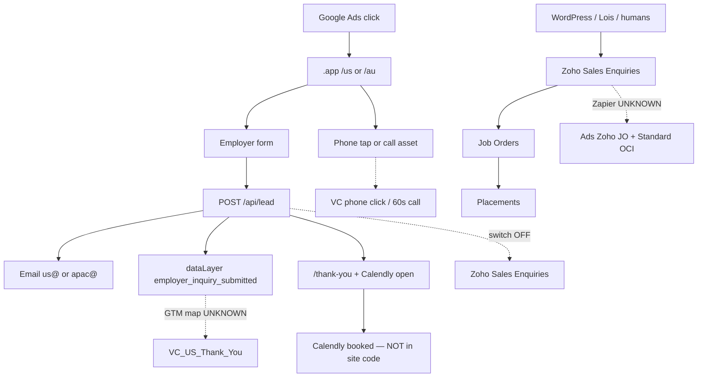
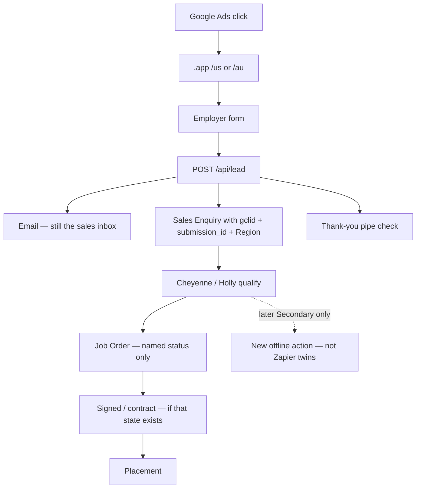

# Attribution architecture map — 13 August 2026

Two pictures. The second is **not live**. Do not treat a field that exists as a working pipe.

---

## Current state (verified)

```text
PAID SEARCH (Maximize Clicks)
  VC_US_S_CORE / VC_US_S_ROLES  →  https://www.virtualcoworker.app/us
  VC_AU_S_CORE / VC_AU_S_ROLES  →  https://www.virtualcoworker.app/au
        │
        ├─ browser sessionStorage keeps gclid / gbraid / wbraid / UTMs / landing URL
        │
        ├─ employer form  →  POST /api/lead  →  email (us@ / apac@) + optional webhook
        │                      ZOHO_CRM_ENABLED = off  →  Zoho is NOT written
        │                      dataLayer: employer_inquiry_submitted (once per submission_id, session only)
        │                      /thank-you?market=&sid=  →  Calendly overlay opens
        │                      calendly_cta_clicked fires; booked event is NOT in the site code
        │
        ├─ tel: tap  →  phone_cta_clicked  (not a 60s call)
        ├─ Google call asset  →  calls-from-ads action (US exists; AU 60s missing on 13 Aug inventory)
        └─ job seeker  →  /ph  →  careers  (never employer conversion)

WORDPRESS / HUMANS / ZAPIER  (still what Zoho looks like)
  virtualcoworker.com / .com.au / Gravity Forms / phone / referral / Forbes
        │
        ├─ Sales Enquiries created by humans + "Social Marketing (Lois)"
        │     sometimes utm_gclid  (576 all-time; 231 in 90 days; 0 in newest 30)
        │     source usually "Website"
        │
        ├─ Job Orders  (mostly Caitlin; 18 have UTM_Gclid; 234/242 link to an enquiry)
        │
        ├─ Placements  (ops after hire; no click id)
        │
        └─ Zapier?  →  Google Ads uploads
              Zoho JO Submitted via Zapier   (67 US / 36 AU)   SECONDARY / museum
              Zoho JO Submitted Standard OCI (23 US / 14 AU)  twin — double-count risk
              Discovery Scheduled twins likewise
              CURRENT ZAP STATUS: UNKNOWN
```

### Compact current flow



---

## Proposed later state — **NOT IMPLEMENTED**

Do not build this today. Do not enable writes from this diagram.

```text
SAME paid campaigns, still Maximize Clicks until quality volume exists

  click id survives: URL → session (later: durable cookie if consented) → form → email AND Sales Enquiry
  Region = USA | AU
  Source = Google Ads when a click id is present (not "Website")
  Unique submission_id stored on a real Zoho field (does not exist today)
  One definition of "qualified job order" named by Caitlin/Cheyenne
  Museum Zapier + Standard OCI stay frozen / unattached to VC_*
  If anything returns to Google later: Secondary only, after human verification
  Thank-you and 60s calls remain the pipe checks
  Calendly booked is a separate event (schedule confirmed), not a second Primary for the same inquiry
  Placement and contract stay reporting, not bidding
```



---

## Detailed route table (current)

| Route | Entry | Destination now | Attribution kept? | Unique id | Dupe protection | Active? | Ads action it may fire | P/S | Campaign-specific? | Failure / uncertainty |
|-------|-------|-----------------|-------------------|-----------|-----------------|---------|------------------------|-----|--------------------|------------------------|
| US paid LP | `/us` | Form → `/api/lead` → email | sessionStorage: gclid, gbraid, wbraid, UTMs, landing, referrer | `submission_id` | 10-min email+market (in-memory); conversion sessionStorage | **Active** | `VC_US_Thank_You` if GTM mapped | Primary (intended) | **UNKNOWN** | GTM map not proven; session lost on new tab; crafted `?sid=` can false-fire |
| AU paid LP | `/au` | Same | Same | Same | Same | **Active** | `VC_AU_Thank_You` | Intended Primary | **UNKNOWN** | Action **not** in 13 Aug inventory |
| Role LPs | `/us/{role}`, `/au/{role}` | Same form + category | Same + category | Same | Same | **Active** | Same as market | Same | **UNKNOWN** | Same |
| Quiz | `/us/quiz`, `/au/quiz` | Same `/api/lead` after quiz | Same + `lp_variant=quiz` | Same | Same | Active, gated, noindex | Same thank-you | Same | **UNKNOWN** | Not the live paid destination |
| Thank-you | `/thank-you?market&sid` | Calendly overlay + phone | `sid` in URL only | `sid` | Session dedupe | **Active** | Thank-you if `sid` present; Calendly **open** only | — | — | Refresh OK; new session + old sid can re-fire; **no booked event in code** |
| Job seeker | Intent gate / `/ph` | `virtualcoworker.com.ph` | Never employer | — | — | **Active** | None (historical museum had a job-seeker click action — do not reuse) | — | — | — |
| US tel: | Site / thank-you | Static **888-964-8644** | Market on click event | — | — | **Active** | `VC_US_Phone_Click_Website` | Primary on disk | **UNKNOWN** | Tap ≠ 60s |
| US website 60s | Same number + Google forwarding tag | Google call conversion | Google forwarding cookie | — | Google | Tag installed; **0 conv** in window | `VC_US_Phone_Call_From_Website` id `7716194324` | Primary | **UNKNOWN** | Fake gclid did not swap the visible number |
| US calls from ads | Call asset | **888-964-8644** (310 also ENABLED on 10 Aug probe) | Google ad-call | — | Google | Action live; **0 conv** | `VC_US_Phone_Call_From_Ads` id `7713239223` | Primary | **UNKNOWN** | 310 leftover **UNKNOWN** after later restore |
| AU tel: | Site | **1300 886 740** | Market on click | — | — | **Active** | `VC_AU_Phone_Click_Website` | Primary on disk | **UNKNOWN** | Type on disk is GA4 custom, not native click-to-call |
| AU 60s website / ads | — | — | — | — | — | **Missing** on 13 Aug inventory | Not created | — | — | Checklist #16 / #17 |
| Calendly booked | Thank-you widget | Cheyenne 30min / APAC 30min | embed domain only | — | — | Widget **active**; booked tracking **not in code** | `VC_*_Calendly_Booked` | Intended Secondary | **UNKNOWN** | Actions not in 13 Aug inventory |
| WordPress US/AU | `.com` / `.com.au` forms | Zoho Sales Enquiries (inferred) | Sometimes `utm_gclid` | Gravity Forms ID field **empty on every record** | **UNKNOWN** | **Active as CRM source** | Museum form / GA4 / Zapier JO | Museum | n/a | Do not revive as paid destination |
| Phone logged in Zoho | Manual / unknown dialer | Calls module (379 in 90d) | **No gclid field** | Zoho id | — | **Active** as sales logging | None automatically | — | — | Cannot join to the ad click |
| Zapier JO upload | Status change? **UNKNOWN** | Google Ads `UPLOAD_CLICKS` | Required a stored gclid | **UNKNOWN** | **UNKNOWN** | **UNKNOWN** if still on | Zoho JO Submitted + Standard OCI twins | Secondary / museum | Must **not** attach to `VC_*` | Double-count if reconnected |
| Zoho Desk | Support tickets | Contacts | None | — | — | Active | None | — | — | PH staff/candidates mixed into Contacts |
| Recruit | Job opening id on 8 JOs | Recruit (barely visible) | None | 8 ids | — | Sparse | None | — | — | May hold hiring; this login barely sees it |
| GA4 / GTM | `.app` containers | GA4 US / AU | Auto tags | — | — | US live; AU GTM live 12 Aug | Auto-imported empty `.app` GA4 actions | Hidden | — | Do not import those as Ads primaries |
| Native Zoho↔Ads | `Google_AdWords` module | — | — | — | — | Module present, `api_supported=false` | — | — | — | Not proof the connector is authorized |

---

## Fields the `.app` form already captures (not written to Zoho)

`submission_id`, name, email, phone, company, market, category, role, UTMs, `gclid`, `gbraid`, `wbraid`, landing page, referrer, lp version/surface, lead score, estimated value (site model only — **not** Ads E).

## Zoho fields that already exist for a later write

`utm_gclid` (Leads), `UTM_Gclid` (Job Orders), `utm_*` / `UTM_*`, `Region`, `Lead_Source`, `Form_Source`, `Referrer`, `Referring_URL`, `Campaign_Name`, `Submission_Timestamp`, `Client_Name` (Job Order → Sales Enquiry).

## Fields that would be required later (do not create them in this pass)

| Need | Live CRM today |
|------|----------------|
| Durable unique `.app` submission id | **Missing** (`VC_Submission_ID` not found) |
| iOS click stamps | **`gbraid` / `wbraid` missing** |
| Source that means Google Ads | Picklist barely used; paid clicks dumped as Website |
| Region transform | CRM wants **USA / AU**; site sends `us` / `au` |
| Dedup against Zapier | No shared transaction id proven |
