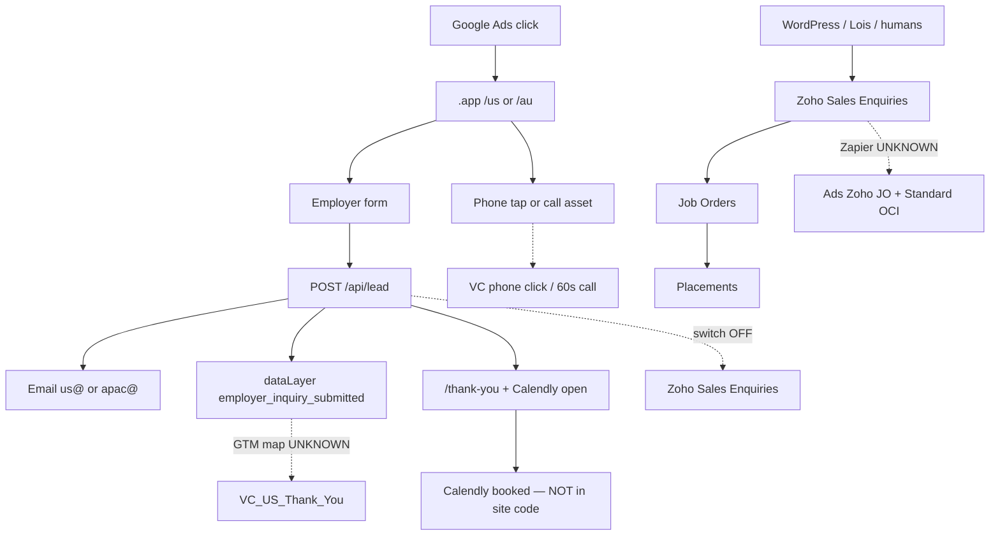
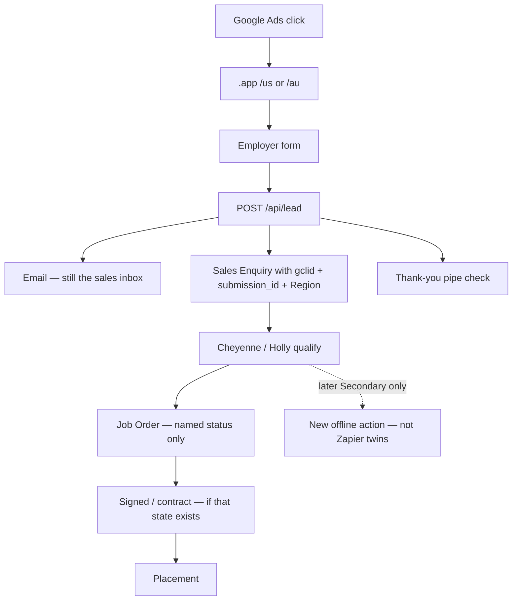

# Attribution recovery — EVERYTHING — 13 August 2026

## Instruction for ChatGPT

Read this entire document as source of truth. Do not summarize unless George asks. Do not parody. Do not imitate George. Do not invent Broad/PMax/Max Conv. Facts vs interpretation stay labeled.

This file is the **one** paste. New evidence pass first. HTML twin: `everything.html`.

**Decision gate:** `NOT READY FOR CRM WRITES OR OFFLINE IMPORT`

Read-only forensic pack. Nothing was written in Zoho. Nothing was sent. Google Ads was not mutated. No Editor import/post. CRM writes stayed off. No keyword / ad group / campaign performance dump.

## Contents

**New pass (correction — read first)**

1. Final evidence addendum (`FINAL-EVIDENCE-ADDENDUM-2026-08-13.md`)
2. Attribution numbers (`ATTRIBUTION-NUMBERS-2026-08-13.csv`)
3. Checklist patch (`CHECKLIST-PATCH-2026-08-13.md`)
4. Team update draft (`TEAM-UPDATE-DRAFT-2026-08-13.md`) — do not send
5. API call log (`API-CALL-LOG-2026-08-13.md`)

**Earlier census (addendum wins where they conflict)**

6. README through ChatGPT audio debrief, plus Zoho appendices

---

# SOURCE: Final evidence addendum

*Original file: `ads-launch/ATTRIBUTION-RECOVERY-2026-08-13/FINAL-EVIDENCE-ADDENDUM-2026-08-13.md` — full text below.*

# Final evidence addendum — 13 August 2026

Read-only. No Ads mutations, Zoho writes, uploads, email, or deploy. Labels: **VERIFIED** / **INFERENCE** / **UNKNOWN**.

**Decision gate (unchanged):** not ready for CRM writes or offline import.

---

## 1. Ads goals — current `VC_*`

**VERIFIED** (API 13 Aug, remaining budget after a first-pass parse crash):

| Campaign | Status | Bidding | Goal config level | Custom goal |
|----------|--------|---------|-------------------|-------------|
| `VC_US_S_CORE` / `VC_US_S_ROLES` | ENABLED | TARGET_SPEND (Maximize Clicks) | **CAMPAIGN** | empty |
| `VC_AU_S_CORE` / `VC_AU_S_ROLES` | ENABLED | TARGET_SPEND | **CAMPAIGN** | empty |

They are not on the account-default basket. Editor CSV still cannot express this; this is Ads UI/API.

**VERIFIED US category map** (same on CORE and ROLES). `biddable=true` only for:

- `PHONE_CALL_LEAD` / WEBSITE
- `PHONE_CALL_LEAD` / CALL_FROM_ADS
- `SUBMIT_LEAD_FORM` / WEBSITE

**VERIFIED US `biddable=false`:** `BOOK_APPOINTMENT`, `CONVERTED_LEAD`, `QUALIFIED_LEAD`, `DOWNLOAD`, `PAGE_VIEW`, `CONTACT`, plus other leftovers. That matches the intended split: thank-you + 60s phone eligible; Calendly booked and Zoho/JO-shaped categories not eligible for bidding. Maximize Clicks does **not** optimize toward those flags today. They would matter if bidding changed.

**UNKNOWN:** AU category/`biddable` map (Ads ceiling hit). Morning conversion-action snapshot (16:03 UTC) still used for named actions — not replayed.

Morning snapshot (not this afternoon): US `VC_US_Thank_You` and three US phone actions ENABLED, `primary_for_goal=true`, `include_in_conversions_metric=false`. AU named `VC_*` in that snapshot: `VC_AU_Phone_Click_Website` only. Zapier/OCI JO: `primary_for_goal=false` on both accounts.

Account-default junk (US eBook `include=true`; AU hidden UA goals) is **not** what `VC_*` inherit while `goal_config_level=CAMPAIGN`. **INFERENCE:** leftover account flags can still confuse the UI; they are not proven attached to `VC_*`.

---

## 2. Historical config — can we prove what automated bidding optimized toward?

**NO** for 1 Aug 2024 – 12 Aug 2026.

| What we have | What it is not |
|--------------|----------------|
| Current `VC_*` = Max Clicks + campaign-level goals | Not history |
| On-disk 2-year **counts** by conversion action | Not which actions were Primary / in-column / campaign-attached in each month |
| Many non-`VC_*` campaigns currently typed Max Conv / similar (US 40/52, AU 41/64) | Current type stamped on a dated report — **not** a month-by-month bidding history |
| `change_event` | Typical lookback ~30 days. Pass 1 fetched 14 days then a FieldMask parse failed; **not retried** |

Monthly action mix for that window: **UNKNOWN this pass** (fetched once, unwritten, not replayed).

Do **not** say historical campaigns optimized toward Zapier JO, forms, or Calendly unless change history says so. Volume in the Conversions column is not proof of the bidding objective at the time.

---

## 3. Zoho join — click-linked only

Correct Ads-relevant denominator is **job orders with a Google click id on the JO or the linked Sales Enquiry**. It is **not** 782 (all sources).

**VERIFIED** (COQL, hashes only):

- Direct `UTM_Gclid` on Job Orders: **18** all-time. All 18 join to a Sales Enquiry. All 18 hashes **match** the enquiry `utm_gclid`. Unique hashes among those 18: **18**. None JO-only, none mismatched.
- 90-day Job Orders sampled: **200 of 242** (newest 200; 42 older 90-day rows not pulled). Of 200: 192 have an enquiry lookup; 18 have a direct GCLID.
- Click-linked in that 200: **69** = 18 on both objects + **51 inherited** (enquiry has GCLID, JO field empty) + 0 JO-only. **131** of 200 have no click id on either object.
- Unique effective hashes among those 69: **62** (some reuse — replacement/returning is plausible, not proven).
- Region of 69: USA **43** · AU **26**. Placement stage **26**. Cancelled-like **29**. Months: 2026-05 **7** · 06 **31** · 07 **25** · 08 **6**.

**UNKNOWN:** inherited GCLID on the 582 Job Orders outside this sample; uniqueness of the 576 enquiry GCLIDs (no bulk export); whether Google still recognizes any click (click date ≠ CRM create date; not looked up in Ads).

**Placements:** Deals have **no** Job Order lookup field (**VERIFIED** schema). Related-list settings API **401**. Related-record names `Deals` / `Placements` / `Contacts` / `Accounts` on a Placement-stage JO returned invalid relation (**VERIFIED**). Explicit JO→Placement link: **UNKNOWN**.

`.app` still does not write Zoho. `ZOHO_CRM_ENABLED` off.

---

## 4. Zapier JO vs Standard OCI

Morning snapshot, window 1 Aug 2024 – 12 Aug 2026:

| Action | US conv / all | AU conv / all | Primary | In conv col |
|--------|---------------|---------------|---------|-------------|
| Zapier JO | 67 / 125 | 36 / 69 | No | No |
| Standard OCI JO | 23 / 85 | 14 / 51 | No | No |

**UNKNOWN:** duplicate vs similar events; shared transaction IDs (none found on CRM); whether Ads can list uploaded click IDs (not queried; reporting API is a poor source of individual upload GCLIDs); whether either Zap is still on. **Did not upload to test.**

Do **not** treat 67+36 as “how many job orders Ads generated,” or 782−103 as “Zapier missed Ads JOs.” 782 is every source. Click-linked in the 90-day sample is 69 of 200, not 782.

---

## 5. Pilot pass/fail (code + Ads + published GTM)

Existence ≠ firing. `VC_*` last-7-day conversions on disk: **0** (CORE/ROLES); US ROLES **1** `all_conversions` in the 2-year window.

| Check | Result | Label |
|-------|--------|-------|
| `VC_*` Maximize Clicks | TARGET_SPEND, ENABLED | VERIFIED |
| Campaign-specific vs account default | CAMPAIGN on all four | VERIFIED |
| US biddable = phone + submit-form; not JO/Calendly categories | as above | VERIFIED |
| AU biddable map | — | UNKNOWN |
| Site fires `employer_inquiry_submitted` once per `submission_id` | code + tests | VERIFIED in code |
| Site listens for Calendly **booked** | **No** (`calendly_cta_clicked` / open only) | VERIFIED |
| GTM listens for `calendly.event_scheduled` → `calendly_event_scheduled` | **Yes** — published US `GTM-M92DX9BJ` **v6**, AU `GTM-5T6KPVSF` **v6** (spec’s AU v5 is stale vs live v6) | VERIFIED in container JS |
| GTM Ads conversion on `employer_inquiry_submitted` (not `form_submit_success`) | Yes, both containers | VERIFIED mapping |
| GTM Ads conversion on `calendly_event_scheduled` | Yes, both containers | VERIFIED mapping |
| Those tags **fired** into Ads | Not proven (desert / no Preview this pass) | UNKNOWN |
| AU thank-you / Calendly / 60s **Ads actions** | Absent from 16:03 inventory; GTM has labels + AU forwarding tag `1300 886 740` | UNKNOWN if created after that pull |
| `.app` → Zoho | Off | VERIFIED |
| Exact+Phrase only live | Not re-queried | UNKNOWN this pass |

---

## Withdraw these earlier claims

- Zoho/Zapier actions were Secondary **throughout history** (today they are Secondary; history **UNKNOWN**).
- Historical Max Conv campaigns optimized toward named actions (forms, Calendly, Zapier JO) — **not proven**.
- The same event definitely fired multiple actions.
- Zapier missed most Ads-generated job orders (invalid vs 782).
- Agencies treated Ads Conversions as the sales book **on purpose**.
- Spend ÷ 103 (or ÷ 67/36) is real CAC.
- All 782 Job Orders should have appeared in Ads.
- “The site does not listen for Calendly booked” — **site code** still does not; **GTM does**.

---

## Still blocked (human)

Caitlin: one JO definition; Zapier on/off. Raffie: GTM Preview one thank-you + one booked fire; Zap screenshot. Cheyenne/Holly: `.app` email + who answers 888 / 1300. Amanda: AU goal screenshot (US category map is already in this addendum).


---

# SOURCE: Attribution numbers

*Original file: `ads-launch/ATTRIBUTION-RECOVERY-2026-08-13/ATTRIBUTION-NUMBERS-2026-08-13.csv` — full text below.*

| metric | market | window | n | unit | label | note |
| --- | --- | --- | --- | --- | --- | --- |
| vc_campaigns_enabled | US | as_of_2026-08-13 | 2 | campaigns | VERIFIED | VC_US_S_CORE + VC_US_S_ROLES |
| vc_campaigns_enabled | AU | as_of_2026-08-13 | 2 | campaigns | VERIFIED | VC_AU_S_CORE + VC_AU_S_ROLES |
| vc_goal_config_level_campaign | US | as_of_2026-08-13 | 2 | campaigns | VERIFIED | not account-default |
| vc_goal_config_level_campaign | AU | as_of_2026-08-13 | 2 | campaigns | VERIFIED | not account-default |
| vc_bidding_target_spend | US+AU | as_of_2026-08-13 | 4 | campaigns | VERIFIED | Maximize Clicks |
| us_vc_biddable_categories | US | as_of_2026-08-13 | 3 | category_origin_pairs | VERIFIED | PHONE_CALL_LEAD website + ads; SUBMIT_LEAD_FORM website |
| us_vc_book_appointment_biddable | US | as_of_2026-08-13 | 0 | flag | VERIFIED | BOOK_APPOINTMENT website biddable=false |
| us_vc_converted_lead_biddable | US | as_of_2026-08-13 | 0 | flag | VERIFIED | CONVERTED_LEAD website biddable=false |
| au_vc_biddable_category_map | AU | as_of_2026-08-13 |  | categories | UNKNOWN | Ads budget exhausted |
| historical_bidding_target_recoverable | US+AU | 2024-08-01_to_2026-08-12 | 0 | proof | VERIFIED | answer=NO; change_event not recovered |
| monthly_conversion_mix | US+AU | 2024-08-01_to_2026-08-12 |  | rows | UNKNOWN | fetched pass1 unwritten; not replayed |
| campaigns_current_conv_shaped_bidding | US | as_of_pull_16:03Z | 40 | of_52 | VERIFIED | current type; not month-by-month history |
| campaigns_current_conv_shaped_bidding | AU | as_of_pull_16:03Z | 41 | of_64 | VERIFIED | current type; not month-by-month history |
| vc_us_core_clicks | US | 2024-08-01_to_2026-08-12 | 234 | clicks | VERIFIED | morning forensic pull |
| vc_us_roles_clicks | US | 2024-08-01_to_2026-08-12 | 109 | clicks | VERIFIED | morning forensic pull |
| vc_au_core_clicks | AU | 2024-08-01_to_2026-08-12 | 84 | clicks | VERIFIED | morning forensic pull |
| vc_au_roles_clicks | AU | 2024-08-01_to_2026-08-12 | 53 | clicks | VERIFIED | morning forensic pull |
| vc_us_core_conversions | US | 2024-08-01_to_2026-08-12 | 0 | conversions | VERIFIED | metrics.conversions |
| vc_us_roles_conversions | US | 2024-08-01_to_2026-08-12 | 0 | conversions | VERIFIED | all_conversions=1 |
| vc_au_core_conversions | AU | 2024-08-01_to_2026-08-12 | 0 | conversions | VERIFIED |  |
| vc_au_roles_conversions | AU | 2024-08-01_to_2026-08-12 | 0 | conversions | VERIFIED |  |
| zoho_job_orders_all_sources | ALL | available_history | 782 | records | VERIFIED | not an Ads denominator |
| zoho_job_orders_90d | ALL | last_90d | 242 | records | VERIFIED | prior census; not replayed |
| zoho_jo_direct_gclid | ALL | all_time | 18 | records | VERIFIED | UTM_Gclid filled |
| zoho_jo_direct_gclid_unique_hashes | ALL | all_time | 18 | hashes | VERIFIED | 18/18 match linked enquiry |
| zoho_jo_90d_rows_in_join_sample | ALL | last_90d_newest_200 | 200 | records | VERIFIED | 242-200=42 not in this join |
| zoho_jo_90d_sample_with_enquiry_lookup | ALL | last_90d_newest_200 | 192 | records | VERIFIED |  |
| zoho_jo_click_linked_90d_sample | ALL | last_90d_newest_200 | 69 | records | VERIFIED | direct 18 + inherited 51; NOT 782 |
| zoho_jo_inherited_gclid_only_90d_sample | ALL | last_90d_newest_200 | 51 | records | VERIFIED | enquiry utm_gclid; JO field empty |
| zoho_jo_click_linked_unique_hashes_90d_sample | ALL | last_90d_newest_200 | 62 | hashes | VERIFIED | 69 rows / 62 hashes |
| zoho_jo_click_linked_usa_90d_sample | USA | last_90d_newest_200 | 43 | records | VERIFIED |  |
| zoho_jo_click_linked_au_90d_sample | AU | last_90d_newest_200 | 26 | records | VERIFIED |  |
| zoho_jo_click_linked_placement_stage_90d_sample | ALL | last_90d_newest_200 | 26 | records | VERIFIED | stage=Placement |
| zoho_jo_click_linked_cancelled_90d_sample | ALL | last_90d_newest_200 | 29 | records | VERIFIED | Job Order Cancelled 28 + Cancelled NHI 1 |
| zoho_jo_click_linked_neither_90d_sample | ALL | last_90d_newest_200 | 131 | records | VERIFIED | no gclid on JO or enquiry |
| zoho_sales_enquiries_with_gclid | ALL | all_time | 576 | records | VERIFIED | prior census; uniqueness UNKNOWN |
| zoho_placements_job_order_lookup_field | ALL | schema | 0 | fields | VERIFIED | Deals has no Job Order lookup |
| zoho_jo_related_deals_or_placements | ALL | one_placement_jo |  | relation | UNKNOWN | common relation names invalid; settings API 401 |
| ads_zoho_jo_zapier_conversions | US | 2024-08-01_to_2026-08-12 | 67 | conversions | VERIFIED | not a census of job orders |
| ads_zoho_jo_zapier_all_conversions | US | 2024-08-01_to_2026-08-12 | 125 | all_conversions | VERIFIED |  |
| ads_zoho_jo_oci_conversions | US | 2024-08-01_to_2026-08-12 | 23 | conversions | VERIFIED | twin; overlap UNKNOWN |
| ads_zoho_jo_oci_all_conversions | US | 2024-08-01_to_2026-08-12 | 85 | all_conversions | VERIFIED |  |
| ads_zoho_jo_zapier_conversions | AU | 2024-08-01_to_2026-08-12 | 36 | conversions | VERIFIED | not a census of job orders |
| ads_zoho_jo_zapier_all_conversions | AU | 2024-08-01_to_2026-08-12 | 69 | all_conversions | VERIFIED |  |
| ads_zoho_jo_oci_conversions | AU | 2024-08-01_to_2026-08-12 | 14 | conversions | VERIFIED | twin; overlap UNKNOWN |
| ads_zoho_jo_oci_all_conversions | AU | 2024-08-01_to_2026-08-12 | 51 | all_conversions | VERIFIED |  |
| zapier_still_active | ALL | as_of_2026-08-13 |  | flag | UNKNOWN | no Zapier access; do not upload to test |
| ads_can_list_uploaded_gclids | ALL | this_pass |  | flag | UNKNOWN | not queried; do not upload to test |
| gtm_us_published_version | US | live_container | 6 | version | VERIFIED | GTM-M92DX9BJ |
| gtm_au_published_version | AU | live_container | 6 | version | VERIFIED | GTM-5T6KPVSF; spec AU v5 is stale |
| gtm_calendly_event_scheduled_listener | US+AU | live_container | 1 | per_container | VERIFIED | existence not firing |
| gtm_employer_inquiry_submitted_ads_tag | US+AU | live_container | 1 | per_container | VERIFIED | existence not firing |
| gtm_form_submit_success_trigger | US+AU | live_container | 0 | triggers | VERIFIED | alias not used as trigger |
| site_calendly_booked_listener | APP | vision_code | 0 | listeners | VERIFIED | open/click only |
| zoho_crm_write_from_app | APP | as_of_2026-08-13 | 0 | enabled | VERIFIED | ZOHO_CRM_ENABLED off |
| api_ads_queries_this_pass | ALL | 2026-08-13 | 12 | queries | VERIFIED | ceiling 12; see API-CALL-LOG |
| api_zoho_requests_this_pass | ALL | 2026-08-13 | 12 | requests | VERIFIED | 8 in join script + 4 related-name probes; ceiling 20 |


---

# SOURCE: Checklist patch

*Original file: `ads-launch/ATTRIBUTION-RECOVERY-2026-08-13/CHECKLIST-PATCH-2026-08-13.md` — full text below.*

# Checklist patch — 13 August 2026 (local only)

**Not deployed.** George overrode X-ray deploy for this pass.

Source of truth for the operator UI: `xray/launch-control.html`.
Companion recovery list: `ads-launch/ATTRIBUTION-RECOVERY-2026-08-13/CHECKLIST.md`.

Preserve existing items. No auto-checks. No Broad / PMax / DSA / Max Conv / budget / Brand enable.

---

## Why these changes (justified only)

| Change | Why it is justified now |
|--------|-------------------------|
| Correct Calendly booked wording | Earlier recovery text said the **site** has no booked listener. That is still true of Vision code. Published GTM **does** listen (`calendly.event_scheduled` → `calendly_event_scheduled`) on US v6 and AU v6. Existence ≠ firing. |
| Correct US thank-you (B) | Morning Ads inventory already has `VC_US_Thank_You`. Live GTM v6 maps `employer_inquiry_submitted` (not the alias) to an Ads conversion tag. Still **not** proven to fire. |
| Correct AU thank-you (D) + #16 hint | AU GTM v6 has a thank-you Ads tag **and** a website-call forwarding config for 1300. Morning Ads inventory still lacked `VC_AU_Thank_You` and AU 60s **actions**. Do not check #16. |
| Add four attribution items (unchecked) | Campaign-specific level is now API-verified; 782 is the wrong import denominator; Zapier/OCI overlap still unknown; Preview still required. |
| Hint on optional “demote old Zoho Primary” | 13 Aug inventory already has Zapier/OCI JO as Secondary. US `VC_*` `CONVERTED_LEAD` is not biddable. |

Do **not** check F, B, C, D, #16, #17, or Z6 from this pass.

---

## Exact diff — `xray/launch-control.html`

### 1. B (`ads51`) hint — replace stale “create in Ads”

**Before:** “Open — not live until you create it in Ads + publish GTM…”

**After:** Action `VC_US_Thank_You` exists (13 Aug inventory). Published GTM-M92DX9BJ v6 maps `employer_inquiry_submitted` only (not `form_submit_success`, not page view). Firing still unproven — GTM Preview one submit. Stay on Maximize Clicks.

### 2. D (`ads53`) hint — GTM tag exists; Ads action lag

**Add:** Published GTM-5T6KPVSF v6 already has an Ads conversion tag on `employer_inquiry_submitted`. Morning Ads inventory (16:03 UTC) did **not** list `VC_AU_Thank_You`. Confirm the AU action exists in the Ads UI before treating D as done. Firing unproven.

### 3. F (`ads70`) hint — GTM listens; site does not

**Before:** “Site already pushes Calendly… Ads action + GTM map can still be tightened later”

**After:** Vision code still only tracks overlay open (`calendly_cta_clicked`). Published GTM (US v6, AU v6) **does** listen for `calendly.event_scheduled` and has Ads conversion tags on `calendly_event_scheduled`. Existence ≠ firing. George still ticks F; we do not auto-check. Next Ads after F remains #16.

### 4. #16 (`ads42`) hint — GTM forwarding present; Ads action not proven

**Add:** Published AU GTM v6 already includes a website-call Google tag with `phone_conversion_number` 1300 886 740. Morning Ads inventory still had **no** AU 60s website-call **action**. Create/confirm the action in AU Ads UI. Do not check this box from GTM alone.

### 5. Item 21 (`ads28`) hint

**Add:** 13 Aug inventory: Zapier + Standard OCI JO are already `primary_for_goal=false`. US `VC_*` campaign conversion goals have `CONVERTED_LEAD` **not** biddable. Optional leftover: confirm they stay unattached. Do not delete museum actions.

### 6. New items (after Z6, before E) — all unchecked

- **AR1.** Amanda: screenshot campaign goals on all four `VC_*`. API: `goal_config_level=CAMPAIGN`. US biddable = phone + submit-form only. AU category map UNKNOWN.
- **AR2.** Do not import or score CAC off **782** Job Orders. Click-linked only (90d sample: 69 of 200 newest).
- **AR3.** Raffie/Caitlin: is Zapier or Standard OCI **still uploading**? Unknown. Do not test with an upload.
- **AR4.** Raffie: GTM Preview — one `employer_inquiry_submitted` fire and one `calendly_event_scheduled` fire. Listeners exist; firing unproven.

JS: never auto-complete `attrRec1`–`attrRec4`.

### 7. Not changed

Brand defense item 9 (`.com` goals) — different campaign. TRAFFIC READY items. Z1–Z6. E. Enable/budget/Brand.

---

## Exact diff — recovery `CHECKLIST.md` N3

**Before:** “Site currently has **no** booked listener”

**After:** “Vision code has **no** booked listener. Published GTM US v6 / AU v6 **do** listen for `calendly.event_scheduled`. Confirm a test booking hits Ads — existence ≠ firing.”


---

# SOURCE: Team update draft

*Original file: `ads-launch/ATTRIBUTION-RECOVERY-2026-08-13/TEAM-UPDATE-DRAFT-2026-08-13.md` — full text below.*

# Team update draft — 13 August 2026

**Do not send.** Draft only. Recipients: Braden, Caitlin, Cheyenne, Holly, Raffie, Amanda.

---

**To:** Braden, Caitlin, Cheyenne, Holly, Raffie, Amanda  
**CC:** George  
**Subject:** Virtual Coworker — connecting Ads, the new site, and Zoho (questions only)

Hi all —

Paid Search is already running as a controlled cold start (Exact + Phrase, Maximize Clicks, new pages on virtualcoworker.app). This week we read how advertising, the new site, and Zoho actually connect. Nothing in this note asks anyone to change bidding, budgets, or how you work deals.

**What we know**

Zoho is the live sales book — US and Australia together, split by Region. Last 90 days the team logged hundreds of sales enquiries, more than two hundred job orders, and more than a hundred placements. That book was never empty. What looked like “no Leads” is a renamed list (Sales Enquiries).

Google Ads historically counted a mix of form fills, thank-you pages, calendar activity, chat, and phone taps, plus a smaller automated “job order” ping. Sales counted enquiries, then job orders, then placements. Those are different objects. The automated job-order number in Ads is not a count of every job order in Zoho, and Zoho’s full job-order list is not what Google should have been expected to see. Only rows that still carry a Google click id can ever be joined. We will not import history into the new campaigns, and we will not turn Zoho into Google’s bidding brain.

The new `VC_*` campaigns stay on Maximize Clicks. Thank-you, a booked consult, and a 60-second phone call are pipe checks so the new account is not a desert. They are not “quality.” They may be reweighted later.

The new site is not writing into Zoho today. Cheyenne and Holly should keep working the book they already have.

**One ask each**

- **Braden:** Treat this as measurement alignment, not a rebuild. No strategy change requested from this note.
- **Caitlin:** When a real employer becomes a job order, is the object we should ever tell Google about the **Job Orders** list (not only the enquiry status “Job Order Submitted”)? And is the old “tell Google Ads a job order happened” path still on?
- **Cheyenne:** When someone submits virtualcoworker.app/us, do you get an email you can work — subject includes Submission ID — and who answers **888-964-8644**?
- **Holly:** Same for virtualcoworker.app/au and **1300 886 740**.
- **Raffie:** In GTM Preview, does one real thank-you fire **once**, and does a **booked** Calendly (not overlay open) fire once? Also: is the old Ads upload Zap on or off? A screenshot of the Zap list is enough. Do not turn anything back on.
- **Amanda:** On the four `VC_*` campaigns, please screenshot campaign-specific goals. We need them limited to the new pipe checks — not the old account basket. No Broad, PMax, or Maximize Conversions ask.

Reply to George. No extra CRM work and no new reporting cadence until those answers exist.

Thanks,  
George


---

# SOURCE: API call log

*Original file: `ads-launch/ATTRIBUTION-RECOVERY-2026-08-13/API-CALL-LOG-2026-08-13.md` — full text below.*

# API call log — 13 August 2026 final evidence pass

Read-only. No mutations, uploads, or retries after schema/parse failures. Stop rule on Ads `RESOURCE_EXHAUSTED` was not hit.

Ceilings: **≤12 Google Ads queries**, **≤20 Zoho CRM requests**.

Token refresh (Zoho accounts OAuth, Ads client build) is not counted as a CRM/Ads query.

---

## Totals

| System | Used | Ceiling | Hard stop |
|--------|-----:|--------:|-----------|
| Google Ads GAQL | **12** | 12 | None |
| Zoho CRM | **12** | 20 | None (one 401 on settings; not retried) |

Pass 1 spent **9** Ads queries then crashed while parsing `change_event.changed_fields` (FieldMask). Results were **not written**. Those 9 still count. Pass 2 used the remaining **3** and did not replay monthly metrics or conversion-action refresh.

---

## Google Ads (customer US `4967151855`, AU `5735391940`; MCC not queried)

| n | Name | Account | OK | Rows / error | Counted? |
|---|------|---------|----|--------------|----------|
| 1 | `us_goal_config_vc` | US | yes (unwritten) | pass1 crash after later parse | Yes |
| 2 | `us_campaign_conversion_goal_vc` | US | yes (unwritten) | pass1 | Yes |
| 3 | `us_conversion_actions` | US | yes (unwritten) | pass1 | Yes |
| 4 | `us_monthly_conversion_actions` | US | yes (unwritten) | pass1; **not replayed** | Yes |
| 5 | `au_goal_config_vc` | AU | yes (unwritten) | pass1 | Yes |
| 6 | `au_campaign_conversion_goal_vc` | AU | yes (unwritten) | pass1; AU map **UNKNOWN** in files | Yes |
| 7 | `au_conversion_actions` | AU | yes (unwritten) | pass1 | Yes |
| 8 | `au_monthly_conversion_actions` | AU | yes (unwritten) | pass1; **not replayed** | Yes |
| 9 | `us_change_event_14d` | US | yes then parse fail | FieldMask not iterable; **not retried** | Yes |
| 10 | `us_goal_config_vc_pass2` | US | yes | 2 | Yes |
| 11 | `au_goal_config_vc_pass2` | AU | yes | 2 | Yes |
| 12 | `us_campaign_conversion_goal_vc_pass2` | US | yes | 28 | Yes |

Not run (ceiling): AU `campaign_conversion_goal` rewrite, AU `change_event`, `custom_conversion_goal`, conversion-action afternoon refresh, `click_view`, offline-upload summaries.

Morning forensic pull (`xray/data/recovery-ads-raw.json`, 16:03 UTC, 9 calls earlier today) is a **separate** prior pass. This log is the final-evidence ceiling only.

---

## Zoho CRM V8 (COQL + GET)

Join script (8):

| n | Name | HTTP | OK | Notes |
|---|------|-----:|----|-------|
| 1 | `jo_gclid_all` | 200 | yes | Job Orders with `UTM_Gclid` |
| 2 | `leads_for_gclid_jos` | 200 | yes | Linked Sales Enquiries for those 18 |
| 3 | `jo_90d_lookup_gclid` | 200 | yes | Newest 200 of 90d Job Orders |
| 4 | `leads_utm_gclid_chunk_1` | 200 | yes | Enquiry GCLID hashes |
| 5 | `leads_utm_gclid_chunk_2` | 200 | yes | |
| 6 | `leads_utm_gclid_chunk_3` | 200 | yes | |
| 7 | `leads_utm_gclid_chunk_4` | 200 | yes | |
| 8 | `related_lists_job_orders` | 401 | no | Settings API; **not retried** |

Related-name probes after the 401 (4; different endpoints, not a retry of settings):

| n | Name | HTTP | Result |
|---|------|-----:|--------|
| 9 | `Job_Orders/{id}/Deals` | 400 | invalid relation name |
| 10 | `Job_Orders/{id}/Placements` | 400 | invalid relation name |
| 11 | `Job_Orders/{id}/Contacts` | 400 | invalid relation name |
| 12 | `Job_Orders/{id}/Accounts` | 400 | invalid relation name |

No bulk export of 782/3,433. No emails, phones, raw GCLIDs, or full record IDs in shipped markdown/CSV. Hashed summaries: `.local/attribution-final-evidence-2026-08-13.json` (gitignored).

---

## Not called

GA4 historical reconstruction · Zapier · GTM Admin API · Ads mutate · Zoho write · conversion upload.


---

**Sections below are the earlier census; prefer the addendum where they conflict.**

---

# SOURCE: README — pack index

*Original file: `ads-launch/ATTRIBUTION-RECOVERY-2026-08-13/README.md` — full text below.*

# Attribution recovery audit — 13 August 2026

Read-only forensic pass. **Nothing was written in Zoho. Nothing was sent. Google Ads was not mutated. No Editor import/post. CRM writes stayed off.**

**Decision gate:** `NOT READY FOR CRM WRITES OR OFFLINE IMPORT`

## Files

| # | File | What it is |
|---|------|------------|
| 1 | [EXECUTIVE-TRUTH.md](EXECUTIVE-TRUTH.md) | What works, what’s broken, what’s unknown |
| 2 | [ATTRIBUTION-MAP.md](ATTRIBUTION-MAP.md) | Current routes vs a later proposed flow (proposed is **not live**) |
| 3 | [CONVERSION-ACTIONS.md](CONVERSION-ACTIONS.md) | Google Ads conversion reconciliation |
| 4 | [ZOHO-DICTIONARY.md](ZOHO-DICTIONARY.md) | Modules, fields, statuses, relationships |
| 5 | [RECOVERABLE-CANDIDATES.md](RECOVERABLE-CANDIDATES.md) | Three buckets. No uploads. Not “great leads.” |
| 6 | [PHONE-ATTRIBUTION.md](PHONE-ATTRIBUTION.md) | Call paths and later options. Do not buy CallRail from this memo. |
| 7 | [CHECKLIST.md](CHECKLIST.md) | Now / Next / Later |
| 8 | [HUMAN-QUESTIONS.md](HUMAN-QUESTIONS.md) | Caitlin, Cheyenne, Holly, Raffie, Amanda |
| 9 | [TEAM-UPDATE-SOURCE-NOTES.md](TEAM-UPDATE-SOURCE-NOTES.md) | Facts for a later email. **Not a draft to send.** |
| 10 | [CHATGPT-AUDIO-DEBRIEF.md](CHATGPT-AUDIO-DEBRIEF.md) | Paste-ready spoken brief |

Record-level IDs (no emails/phones) live only under `.local/zoho/probe-attribution-recovery-2026-08-13.json` (gitignored).

## What this pass did

- Read on-disk Ads snapshots (`xray/data/*`, recovery audit of 13 Aug).
- Independently verified Zoho census facts, then **11 cheap CRM reads** for click-ID recency, Lois metadata, and a small candidate set.
- Read `virtualcoworker.app` form, tracking, Zoho mapping, and Calendly code.
- **Did not** call Google Ads API this pass (conversion inventory already on disk from 13 Aug).
- **Did not** enable `ZOHO_CRM_ENABLED`, touch Zapier, publish GTM, or send email.

## Live acquisition (do not “fix” from this folder)

US: `VC_US_S_CORE` / `VC_US_S_ROLES` · Exact + Phrase · Maximize Clicks · `https://www.virtualcoworker.app/us`  
AU: `VC_AU_S_CORE` / `VC_AU_S_ROLES` · same · `/au`  
Brand deferred. Quiz / PH still gated. Form thank-you, Calendly booked, and 60-second phone are the intended pipe checks ($1 placeholders; Primary OK for now). **E (form $ matrix) is not next.**


---

# SOURCE: Executive truth

*Original file: `ads-launch/ATTRIBUTION-RECOVERY-2026-08-13/EXECUTIVE-TRUTH.md` — full text below.*

# Executive truth — 13 August 2026

**Decision gate:** `NOT READY FOR CRM WRITES OR OFFLINE IMPORT`

Read-only. Nothing written, sent, posted, or enabled.

---

## What is currently working

- One Zoho CRM named **Virtual Coworker** is the real sales book. US and AU live together, split by **Region** (USA / AU). The Leads list is labelled **Sales Enquiries**. Deals are labelled **Placements**. **Job Orders** is a custom list beside those.
- Last 90 days the team logged **647 sales enquiries**, **242 job orders**, **122 placements**, **102 new contacts**, and **379 calls**. That is a working company, not an empty CRM.
- The new paid pages on **virtualcoworker.app** have a real form. A completed US/AU employer form goes to `POST /api/lead`, then email (designed as `us@` / `apac@`) and an optional webhook. Job-seekers are sent to careers and **do not** fire the employer conversion event.
- The form **can** keep Google click stamps (`gclid`, `gbraid`, `wbraid`) plus UTMs and landing page in the browser session and put them on the email. Unique id: `submission_id`.
- Live Search is a cold start on Maximize Clicks: `VC_US_S_CORE` / `VC_US_S_ROLES` and the AU twins. Exact + Phrase. Destinations `/us` and `/au`. Brand is deferred.
- New `VC_*` conversion actions exist in the US account for thank-you, 60-second calls from ads, 60-second website calls, and phone click. AU has a phone-click action. These are pipe checks, not proof of a hire. `VC_*` campaigns themselves show **0** conversions in the last-7-day snapshots.
- Most recent job orders **do** link back to a sales enquiry (`Client_Name` filled on **234 / 242** job orders in 90 days).

## What is broken

- **Google Ads and Zoho were never measuring the same object.** From 1 Aug 2024 to 12 Aug 2026 the two accounts spent about **$1.18 million**. Ads reported thousands of “conversions” (forms, thank-you pages, Calendly, chat, phone taps, a job-seeker click). The only CRM-shaped Ads number is a Zapier upload named Zoho JO Submitted: **67 US + 36 AU**, plus a twin called Standard OCI (**23 + 14**). This CRM has **782 job orders** in the same years. The Ads number is a thin, duplicate-prone slice — not how many job orders happened.
- **`.app` is not writing into Zoho.** Today’s CRM still looks like WordPress, Zapier, and humans. The paid-site switch `ZOHO_CRM_ENABLED` is off (example and this pass). Newest 30 enquiries: **zero** click ids. After 5 Aug 2026, new enquiries stopped storing `utm_gclid`.
- **Website ≠ Google Ads.** 550 of 647 recent enquiries are sourced Website. Only 6 say Google. You cannot filter paid-search leads from source alone.
- **Click ids die as the deal gets more real.** Enquiries: **576 / 3,433** ever stored `utm_gclid`. Job orders: **18 / 782**. Placements: no click-id field found.
- **Enquiry status “Job Order Submitted” is not the same object as a Job Orders row.** 213 vs 242 in 90 days. Job Orders stage “Job Order Submitted” is only **3**. Standard Zoho “convert lead” almost unused (**1** in 90 days).
- **Junk sits in the same lists.** Newest 20 enquiries that still have a click id: **10 marked Junk Lead**. Tests sit in job orders. Philippines Desk contacts sit in Contacts.
- **Calendly open is not booked.** The site fires `calendly_cta_clicked`. There is **no** booked-event listener in the `.app` code. Historical Ads “LK - Scheduled Calendly Call” (373 US) is a museum action, not the new pipe.
- **A phone tap is not a 60-second conversation.** US 60s actions exist and show 0 conversions in the forensic window. AU 60s website-call and ad-call actions were **not** in the 13 Aug inventory. CallRail is absent. Zoho logs calls (379 in 90 days) but those rows have no Google click id.
- **Vision’s Zoho mapper does not match live field names.** Code prefers `$gclid` and `VC_Submission_ID`. Live CRM uses `utm_gclid` / `UTM_Gclid`. `VC_Submission_ID`, `gbraid`, and `wbraid` **do not exist** on Sales Enquiries.

## What is unknown

| Item | Why it is unknown |
|------|-------------------|
| Whether the old Zapier → Ads path is still on | No Zapier access. Zoho webhook/workflow APIs were not readable. |
| Whether Google still recognizes any stored click id | Import window is from the **click**, not the CRM create date. Not checked in Ads. |
| Whether any of the 18 job-order click ids were already uploaded | Zapier / Standard OCI overlap not matched record-by-record. |
| Campaign-specific goals on each `VC_*` campaign | Not in the on-disk pull. Account-default junk (US eBook, AU hidden UA goals) is a latent risk if inherited. |
| Whether production email (`us@` / `apac@`) is actually delivering | Designed in code. Production env not read. |
| Who or what **Social Marketing (Lois)** is | Active Administrator, CEO profile, `virtualcoworker.com` domain. Created 21 of the newest 30 enquiries. Last-activity field not returned. |
| Whether Recruit holds the real hiring pipeline | Recruit id on job orders: **8** all-time. |
| What “signed client” is in Zoho | Placements have `Contract_Invoice_Status`. Meaning unused without a human. |
| Why all-time counts equal 1 Aug 2024 | Rebuild vs imported dates. |
| Remaining Zoho API credits today | Headers not sent. This pass used 11 reads after the earlier census. |
| Whether George’s later Ads UI work (Calendly booked / AU thank-you / $1 placeholders) is already live | 13 Aug inventory has US thank-you + US 60s calls + AU phone click. Calendly booked and AU 60s/thank-you were **not** in that inventory. Do not infer they fire. |

## What Google Ads currently thinks is a conversion

**On `VC_*` last 7 days:** nothing. The Conversions column is a desert. That is expected on Maximize Clicks while the pipe is being proven.

**Account-default “in Conversions column” (include_in_conversions_metric = true):** US = hidden **eBook Download** (0 in two years). AU = six hidden Universal Analytics goals (Chat, Submission ×2, Job order form, Lead Form Submit Completion, Transactions) — also 0. Those are museum leftovers, not the new system.

**What filled the old accounts for two years:** WordPress free-consultation forms, GA4 thank-you pages, Calendly, chat opens, phone taps, a job-seeker click, and a thin Zapier/OCI job-order upload. Many of those were Primary or double-counted. **Do not attach them to `VC_*`.**

George’s intended pipe checks (thank-you, Calendly booked, 60-second phone, $1 placeholders, Primary OK for now) are the right *idea*. On disk, some US actions exist and show **0**. Firing is **not proven**. E (form $) is not next.

## What Zoho considers an enquiry, job order, and placement

| Object | What it is | What it is not |
|--------|------------|----------------|
| **Sales Enquiry** | A person/company logged for sales to work. Status is a human disposition (junk, not a fit, brochure, discovery, job order submitted…). | Not automatically a Google click. Not a job order. |
| **Job Order** | A recruiting request the team is staffing. Stages include sourcing, interviews, endorsed, placement, cancelled. Almost half of the last 90 days were cancelled (97 / 242). | Not proof the click was paid search. Not a signed-client field by itself. Not a placement. |
| **Placement** | After-the-hire ops (New Placement, Day 1 check-in, 1 month, cancelled…). | Not an ad click. 41 of 122 recent placements have blank Region. |

A raw enquiry is not a qualified employer. A job order is not necessarily signed. A placement is the hire, and some of those cancel too.

## Does the new `.app` funnel reach Zoho?

**No.** Not today.

The write path exists in code and is gated off. Email/webhook is the live design. Zoho still receives WordPress / Zapier / human rows. That is two movies.

## Can a trustworthy historical winner be recovered?

**Not as a bidding truth.** Old Ads “winners” are mostly form fills and appointment pings on WordPress, often at very high CPA, often overlapping. Zoho JO 67/36 is not a census of job orders.

**As research:** yes, carefully. There is a stash of click ids (576 enquiries; 18 job orders). That can teach which *old* pages and sources existed. It must not be attached to `VC_*` and must not drive Maximize Conversions.

## Are any recent outcomes potentially importable?

**A small set is worth human review. None are ready to upload.**

- **231** enquiries in the last 90 days still have `utm_gclid` — but the newest 20 of those are half junk, and **after 5 Aug the new enquiries have none**.
- **All 18** job orders that ever stored a click id were created between 20 Jul and 7 Aug 2026. All 18 link to a sales enquiry. Four are already Placement. Two have `utm_source = chatgpt.com` (do not treat as Google Ads). Three are cancelled.
- Google may still reject them: we do not know the **click** date, and we do not know if Zapier already uploaded them.

See [RECOVERABLE-CANDIDATES.md](RECOVERABLE-CANDIDATES.md). Do not call them great leads.

## What must be verified before any integration

1. Caitlin / Cheyenne name the **one** status that means “real job order we would ever tell Google about.”
2. Someone who can see Zapier says whether the old upload is **still on**.
3. Cheyenne / Holly confirm they actually receive `.app` emails and can tell them from WordPress rows.
4. Raffie (or equivalent) can show whether GTM maps `employer_inquiry_submitted` once, and whether Calendly **booked** (not open) is mapped.
5. Amanda can confirm campaign-specific goals on `VC_*` exclude museum actions.
6. Only then consider a **later** Secondary offline path — never a Primary, never a backfill of the 576, never both Zapier and a new uploader.

Until then: stay on Maximize Clicks. Score quality through Cheyenne and Holly, not through this CRM’s Google column.


---

# SOURCE: Attribution architecture map

*Original file: `ads-launch/ATTRIBUTION-RECOVERY-2026-08-13/ATTRIBUTION-MAP.md` — full text below.*

# Attribution architecture map — 13 August 2026

Two pictures. The second is **not live**. Do not treat a field that exists as a working pipe.

---

## Current state (verified)

```text
PAID SEARCH (Maximize Clicks)
  VC_US_S_CORE / VC_US_S_ROLES  →  https://www.virtualcoworker.app/us
  VC_AU_S_CORE / VC_AU_S_ROLES  →  https://www.virtualcoworker.app/au
        │
        ├─ browser sessionStorage keeps gclid / gbraid / wbraid / UTMs / landing URL
        │
        ├─ employer form  →  POST /api/lead  →  email (us@ / apac@) + optional webhook
        │                      ZOHO_CRM_ENABLED = off  →  Zoho is NOT written
        │                      dataLayer: employer_inquiry_submitted (once per submission_id, session only)
        │                      /thank-you?market=&sid=  →  Calendly overlay opens
        │                      calendly_cta_clicked fires; booked event is NOT in the site code
        │
        ├─ tel: tap  →  phone_cta_clicked  (not a 60s call)
        ├─ Google call asset  →  calls-from-ads action (US exists; AU 60s missing on 13 Aug inventory)
        └─ job seeker  →  /ph  →  careers  (never employer conversion)

WORDPRESS / HUMANS / ZAPIER  (still what Zoho looks like)
  virtualcoworker.com / .com.au / Gravity Forms / phone / referral / Forbes
        │
        ├─ Sales Enquiries created by humans + "Social Marketing (Lois)"
        │     sometimes utm_gclid  (576 all-time; 231 in 90 days; 0 in newest 30)
        │     source usually "Website"
        │
        ├─ Job Orders  (mostly Caitlin; 18 have UTM_Gclid; 234/242 link to an enquiry)
        │
        ├─ Placements  (ops after hire; no click id)
        │
        └─ Zapier?  →  Google Ads uploads
              Zoho JO Submitted via Zapier   (67 US / 36 AU)   SECONDARY / museum
              Zoho JO Submitted Standard OCI (23 US / 14 AU)  twin — double-count risk
              Discovery Scheduled twins likewise
              CURRENT ZAP STATUS: UNKNOWN
```

### Compact current flow



---

## Proposed later state — **NOT IMPLEMENTED**

Do not build this today. Do not enable writes from this diagram.

```text
SAME paid campaigns, still Maximize Clicks until quality volume exists

  click id survives: URL → session (later: durable cookie if consented) → form → email AND Sales Enquiry
  Region = USA | AU
  Source = Google Ads when a click id is present (not "Website")
  Unique submission_id stored on a real Zoho field (does not exist today)
  One definition of "qualified job order" named by Caitlin/Cheyenne
  Museum Zapier + Standard OCI stay frozen / unattached to VC_*
  If anything returns to Google later: Secondary only, after human verification
  Thank-you and 60s calls remain the pipe checks
  Calendly booked is a separate event (schedule confirmed), not a second Primary for the same inquiry
  Placement and contract stay reporting, not bidding
```



---

## Detailed route table (current)

| Route | Entry | Destination now | Attribution kept? | Unique id | Dupe protection | Active? | Ads action it may fire | P/S | Campaign-specific? | Failure / uncertainty |
|-------|-------|-----------------|-------------------|-----------|-----------------|---------|------------------------|-----|--------------------|------------------------|
| US paid LP | `/us` | Form → `/api/lead` → email | sessionStorage: gclid, gbraid, wbraid, UTMs, landing, referrer | `submission_id` | 10-min email+market (in-memory); conversion sessionStorage | **Active** | `VC_US_Thank_You` if GTM mapped | Primary (intended) | **UNKNOWN** | GTM map not proven; session lost on new tab; crafted `?sid=` can false-fire |
| AU paid LP | `/au` | Same | Same | Same | Same | **Active** | `VC_AU_Thank_You` | Intended Primary | **UNKNOWN** | Action **not** in 13 Aug inventory |
| Role LPs | `/us/{role}`, `/au/{role}` | Same form + category | Same + category | Same | Same | **Active** | Same as market | Same | **UNKNOWN** | Same |
| Quiz | `/us/quiz`, `/au/quiz` | Same `/api/lead` after quiz | Same + `lp_variant=quiz` | Same | Same | Active, gated, noindex | Same thank-you | Same | **UNKNOWN** | Not the live paid destination |
| Thank-you | `/thank-you?market&sid` | Calendly overlay + phone | `sid` in URL only | `sid` | Session dedupe | **Active** | Thank-you if `sid` present; Calendly **open** only | — | — | Refresh OK; new session + old sid can re-fire; **no booked event in code** |
| Job seeker | Intent gate / `/ph` | `virtualcoworker.com.ph` | Never employer | — | — | **Active** | None (historical museum had a job-seeker click action — do not reuse) | — | — | — |
| US tel: | Site / thank-you | Static **888-964-8644** | Market on click event | — | — | **Active** | `VC_US_Phone_Click_Website` | Primary on disk | **UNKNOWN** | Tap ≠ 60s |
| US website 60s | Same number + Google forwarding tag | Google call conversion | Google forwarding cookie | — | Google | Tag installed; **0 conv** in window | `VC_US_Phone_Call_From_Website` id `7716194324` | Primary | **UNKNOWN** | Fake gclid did not swap the visible number |
| US calls from ads | Call asset | **888-964-8644** (310 also ENABLED on 10 Aug probe) | Google ad-call | — | Google | Action live; **0 conv** | `VC_US_Phone_Call_From_Ads` id `7713239223` | Primary | **UNKNOWN** | 310 leftover **UNKNOWN** after later restore |
| AU tel: | Site | **1300 886 740** | Market on click | — | — | **Active** | `VC_AU_Phone_Click_Website` | Primary on disk | **UNKNOWN** | Type on disk is GA4 custom, not native click-to-call |
| AU 60s website / ads | — | — | — | — | — | **Missing** on 13 Aug inventory | Not created | — | — | Checklist #16 / #17 |
| Calendly booked | Thank-you widget | Cheyenne 30min / APAC 30min | embed domain only | — | — | Widget **active**; booked tracking **not in code** | `VC_*_Calendly_Booked` | Intended Secondary | **UNKNOWN** | Actions not in 13 Aug inventory |
| WordPress US/AU | `.com` / `.com.au` forms | Zoho Sales Enquiries (inferred) | Sometimes `utm_gclid` | Gravity Forms ID field **empty on every record** | **UNKNOWN** | **Active as CRM source** | Museum form / GA4 / Zapier JO | Museum | n/a | Do not revive as paid destination |
| Phone logged in Zoho | Manual / unknown dialer | Calls module (379 in 90d) | **No gclid field** | Zoho id | — | **Active** as sales logging | None automatically | — | — | Cannot join to the ad click |
| Zapier JO upload | Status change? **UNKNOWN** | Google Ads `UPLOAD_CLICKS` | Required a stored gclid | **UNKNOWN** | **UNKNOWN** | **UNKNOWN** if still on | Zoho JO Submitted + Standard OCI twins | Secondary / museum | Must **not** attach to `VC_*` | Double-count if reconnected |
| Zoho Desk | Support tickets | Contacts | None | — | — | Active | None | — | — | PH staff/candidates mixed into Contacts |
| Recruit | Job opening id on 8 JOs | Recruit (barely visible) | None | 8 ids | — | Sparse | None | — | — | May hold hiring; this login barely sees it |
| GA4 / GTM | `.app` containers | GA4 US / AU | Auto tags | — | — | US live; AU GTM live 12 Aug | Auto-imported empty `.app` GA4 actions | Hidden | — | Do not import those as Ads primaries |
| Native Zoho↔Ads | `Google_AdWords` module | — | — | — | — | Module present, `api_supported=false` | — | — | — | Not proof the connector is authorized |

---

## Fields the `.app` form already captures (not written to Zoho)

`submission_id`, name, email, phone, company, market, category, role, UTMs, `gclid`, `gbraid`, `wbraid`, landing page, referrer, lp version/surface, lead score, estimated value (site model only — **not** Ads E).

## Zoho fields that already exist for a later write

`utm_gclid` (Leads), `UTM_Gclid` (Job Orders), `utm_*` / `UTM_*`, `Region`, `Lead_Source`, `Form_Source`, `Referrer`, `Referring_URL`, `Campaign_Name`, `Submission_Timestamp`, `Client_Name` (Job Order → Sales Enquiry).

## Fields that would be required later (do not create them in this pass)

| Need | Live CRM today |
|------|----------------|
| Durable unique `.app` submission id | **Missing** (`VC_Submission_ID` not found) |
| iOS click stamps | **`gbraid` / `wbraid` missing** |
| Source that means Google Ads | Picklist barely used; paid clicks dumped as Website |
| Region transform | CRM wants **USA / AU**; site sends `us` / `au` |
| Dedup against Zapier | No shared transaction id proven |


---

# SOURCE: Conversion-action reconciliation

*Original file: `ads-launch/ATTRIBUTION-RECOVERY-2026-08-13/CONVERSION-ACTIONS.md` — full text below.*

# Conversion-action reconciliation — 13 August 2026

Source of truth for this table: `xray/data/recovery-audit.json` and `xray/data/recovery/conversions.csv` (window **1 Aug 2024 – 12 Aug 2026**). Attribution model and last-conversion date: **UNKNOWN** (not in the pull). Campaign-specific attachment on `VC_*`: **UNKNOWN**.

Google Ads API was **not** called again this pass.

**How to read “In Conv col”:** `include_in_conversions_metric`. That is what fills the account-default Conversions column. `primary_for_goal` is a separate flag on disk.

George’s current intent: thank-you, Calendly booked, and 60s phone are pipe checks; $1 placeholders; Primary OK for now; **E is not next**. On-disk inventory may lag later Ads UI work. Do not infer firing from existence.

---

## Answers

1. **What appears in the Conversions column today?**  
   On `VC_*` last 7 days: **0**. Account-default “in column” leftovers are US **eBook** and AU hidden UA goals — all **0** in two years. Historically the column was WordPress forms, thank-you pages, Calendly, calls, chat, and a thin Zoho upload.

2. **Which recent conversions are shallow pipe checks?**  
   `VC_US_Thank_You`, `VC_US_Phone_Click_Website`, `VC_AU_Phone_Click_Website`. Tel taps. Calendly **open**. Thank-you page views if anyone maps URL contains `thank-you` (must not).

3. **Are any actions firing twice?**  
   **Historically yes:** WP form + GA4 thank-you; Zapier + Standard OCI twins (JO and Discovery); AU Original + GA4 form. **Currently on `VC_*`:** 0 + 0, so no live double-fire observed.

4. **Could one form become multiple Primaries?**  
   **Yes if miswired:** thank-you event + form-submit alias + Calendly booked + Zoho offline, all Primary. Site already fires `employer_inquiry_submitted` and alias `form_submit_success` — GTM must map **only** the first. Crafted `/thank-you?sid=` can false-fire once per id.

5. **Are historical account-default goals silently attached to `VC_*`?**  
   **UNKNOWN.** If inherited, the only `include_in_conversions_metric: true` leftovers are junk with 0 volume. Still isolate goals in the Ads UI.

6. **US / AU separation?**  
   Separate customer IDs (`496-715-1855` / `573-539-1940`), separate GTM/GA4. Leak: AU account contains empty actions named **“VC US — virtualcoworker.app”**.

7. **Campaign-specific goals configured as intended?**  
   **UNKNOWN.** Planned: only new `VC_*` pipe checks. Editor CSV cannot express this.

8. **Anything influencing bidding that should not?**  
   `VC_*` are **Maximize Clicks** (`TARGET_SPEND`) — not conversion-optimized today. Switching those campaigns to Maximize Conversions while museum defaults remain would be the failure mode. Do not switch.

---

## New `VC_*` system (keep)

| Acct | Name | ID | Type | Status | Primary | In Conv col | Count | Window | Value | Conv / All (2y) | Cohort / risk |
|------|------|-----|------|--------|---------|-------------|-------|--------|-------|-----------------|---------------|
| US | `VC_US_Phone_Call_From_Ads` | 7713239223 | AD_CALL 60s | ENABLED | Yes | No | One | 30d | $0 | 0 / 0 | Pipe check. 0 fires in window. |
| US | `VC_US_Phone_Call_From_Website` | 7716194324 | WEBSITE_CALL 60s | ENABLED | Yes | No | One | 30d | $100 on disk | 0 / 0 | Label `Sf71CJSQr98cEOPyhMsD`. George later wants $1 placeholders — **UNKNOWN** if UI already changed. |
| US | `VC_US_Phone_Click_Website` | 7713281413 | CLICK_TO_CALL | ENABLED | Yes | No | One | 30d | $0 | 0 / 2 | Tap ≠ 60s. |
| US | `VC_US_Thank_You` | 7718196602 | WEBPAGE | ENABLED | Yes | No | One | 90d | $1 | 0 / 0 | GTM map **UNKNOWN**. Do not also map `form_submit_success`. |
| AU | `VC_AU_Phone_Click_Website` | 7719216886 | GA4_CUSTOM | ENABLED | Yes | No | One | 90d | $1 | 0 / 0 | Shallow. Not a 60s call. |
| AU | `VC_AU_Thank_You` | — | — | **Not in 13 Aug inventory** | Intended | — | — | — | — | — | Create-in-UI was still open on disk. |
| AU | AU website-call 60s | — | — | **Missing** | Intended | — | — | — | — | — | Checklist #16. |
| AU | AU ad-call 60s | — | — | **Missing** | Intended | — | — | — | — | — | Checklist #17. |
| US/AU | `VC_*_Calendly_Booked` | — | — | **Not in 13 Aug inventory** | Intended Secondary | — | — | — | — | — | Site has **no booked listener**. |

Empty GA4 auto-imports named `VC US — .app close_convert_lead / purchase / qualify_lead` (and AU copies): HIDDEN, 0, **museum noise**. Do not use.

---

## Historical museum — do **not** attach to `VC_*`

| Acct | Name | ID | Type | Primary | In Conv col | Conv / All (2y) | Overlap / risk |
|------|------|-----|------|---------|-------------|-----------------|----------------|
| US | Zoho JO Submitted US [Original] via Zapier | 7387464177 | UPLOAD_CLICKS | No | No | **67 / 125** | Best CRM-shaped Ads number. **Unverified.** Not a census of 782 JOs. |
| US | Zoho JO Submitted US [Standard OCI] | 7556921934 | UPLOAD_CLICKS | No | No | **23 / 85** | Twin of Zapier. Double-count if both live. |
| US | Zoho Discovery Scheduled US [Zapier] | 7387413269 | UPLOAD_CLICKS | No | No | 33 / 317 | Twin with OCI Discovery. |
| US | Zoho Discovery Scheduled US [Standard OCI] | 7556617802 | UPLOAD_CLICKS | No | No | 1 / 109 | Twin. |
| AU | Zoho JO Submitted AU [Original] via Zapier | (see recovery CSV) | UPLOAD_CLICKS | No | No | **36 / 69** | Same story as US. |
| AU | Zoho JO Submitted AU [Standard OCI] | (see recovery CSV) | UPLOAD_CLICKS | No | No | **14 / 51** | Twin. |
| AU | Zoho Discovery Scheduled AU [Zapier] / [Standard OCI] | — | UPLOAD_CLICKS | No | No | 48 / 231 and 3 / 19 | Twins. |
| US | Free Consultation Form Submitted [Original] | 6874549832 | WEBPAGE | No | No | 1036 / 1843 | WordPress. Overlaps GA4 thank-you. |
| US | GA4 contact_us___thank_you_page | removed | — | — | — | 788 / 837 | Removed; still in 2y metrics. |
| US | LK - Scheduled Calendly Call | removed | — | — | — | 373 / 457 | Museum booked signal. Not the new F action. |
| US | Calls from Ads* | removed | — | — | — | 241 / 271 | Legacy 60s unverified. |
| US | Clicks "I am searching for a job" | removed | — | — | — | 0 / **54** | **Confirmed job-seeker conversion.** |
| AU | Free Consultation Form Submitted [Original] + [GA4] | — | WEBPAGE / GA4 | No | No | 944 / 1154 and 232 / 1156 | Triple-count form risk. |
| AU | Chat Opened / Chat Started Oct 2023 | removed | — | — | — | 0 / 184 and 0 / 164 | Chat ≠ lead. |
| US | eBook Download (All Web Site Data) | 314649573 | UA_GOAL HIDDEN | **Yes** | **Yes** | 0 / 0 | Junk Primary still in column flag. |
| AU | Chat / Submission ×2 / Job order form / Lead Form Submit / Transactions | UA HIDDEN | UA | **Yes** | **Yes** | 0 / 0 | Junk Primaries still in column flag. |

Full 67-row dump: `xray/data/recovery/conversions.csv`.

---

## Hard rules (unchanged)

- Do not attach Zoho/Zapier / Standard OCI / UA / old Calendly / job-seeker click to `VC_*`.
- One inquiry ≠ two Primaries.
- Do not switch Maximize Clicks → Maximize Conversions on this CRM.
- E (form $ matrix) is not next.
- Leave museum actions in the account for history. Do not delete them in this pass.


---

# SOURCE: Zoho field and relationship dictionary

*Original file: `ads-launch/ATTRIBUTION-RECOVERY-2026-08-13/ZOHO-DICTIONARY.md` — full text below.*

# Zoho field and relationship dictionary — 13 August 2026

Org: **Virtual Coworker** · Zoho One Enterprise · AUD · Brisbane time · one CRM for USA and AU.  
API: CRM V8. UI “no Leads” is a **rename**.

This is a dictionary, not permission to write.

---

## Modules

| API name | What sales sees | Role in the journey |
|----------|-----------------|---------------------|
| `Leads` | **Sales Enquiries** | Front door. Human status lives here. |
| `Job_Orders` | **Job Orders** | Custom module. Recruiting request. |
| `Deals` | **Placements** | After the hire. |
| `Contacts` | Contacts | Long dump (8,011). Not the paid-search inbox. Newest include Zoho Desk / PH people. |
| `Accounts` | Accounts | Company record. |
| `Calls` | Calls | 379 in 90 days. Duration fields exist. **No gclid.** |
| `Job_Openings` | Recruitments (webtab) | `api_supported=false`. Recruit barely visible. |
| `Google_AdWords` | Google Ads | Present. `api_supported=false`. **Not** proof the connector is on. |

Installed extras visible as modules: Sinch SMS (`twiliosmsextension0__*`), Zoho Sign, Zoho Desk. **CallRail: not found. Calendly: not found. Zapier: not a CRM module.**

---

## Volume (independently re-checked)

| List | All-time | Last 90 days | Since 1 Aug 2024 |
|------|--------:|-------------:|-----------------:|
| Sales Enquiries | 3,433 | 647 | 3,433 |
| Job Orders | 782 | 242 | 782 |
| Placements | 386 | 122 | 386 |
| Contacts | 8,011 | 102 | 8,011 |
| Calls | — | 379 | — |

All-time = since 1 Aug 2024. Why: **UNKNOWN** (rebuild vs imported dates).

---

## Sales Enquiries (`Leads`) — fields that matter

| API name | Label | Type | Notes |
|----------|-------|------|-------|
| `id` | Record id | id | Use in restricted artifacts only. |
| `Region` | Region | picklist | **USA** / **AU** / blank. 90d: 338 / 283 / 26. |
| `Lead_Status` | Lead Status | picklist | Human disposition. See below. |
| `Lead_Source` | Sales Enquiry Source | picklist | 90d: Website 550, blank 57, Forbes 10, Phone 7, Zen Desk 7, Google **6**. |
| `Form_Source` | Form Source | text | 90d: Job Order Form 222, blank 425. |
| `Gravity_Form_Entry_ID` | Gravity Form Entry ID | text | **0 populated all-time.** |
| `utm_gclid` | utm_gclid | text | **The** click id. 576 all-time; **231 in 90d**; 0 in newest 30. Not `$gclid`. |
| `utm_source` `utm_medium` `utm_campaign` `utm_term` `utm_content` | UTM | text | Present. |
| `Campaign_Name` | Campaign Name | text | Text, not a live Ads link. |
| `Referrer` `Referring_URL` `Website` | URLs | website | Hosts observed: WordPress-era, not `.app`. |
| `Submission_Timestamp` | Submission Timestamp | datetime | |
| `Job_Order_submitted_via_form` | Job Order submitted via form | boolean | **0** in 90 days. |
| `Converted__s` `Converted_Account` `Converted_Contact` `Converted_Deal` | Standard convert | — | Almost unused (**1** converted in 90d). |
| `Account` | Account | lookup | |
| `gbraid` `wbraid` `VC_Submission_ID` | — | — | **Do not exist.** |

### `Lead_Status` seen in last 90 days (647)

| Status | n | Plain meaning (inferred — confirm with Caitlin) |
|--------|--:|--------------------------------------------------|
| Job Order Submitted | 213 | Sales says this enquiry became a job order. **≠ automatic Job Orders row.** |
| Unresponsive Clients | 111 | Dead / asleep |
| Decided Against / Not a Fit | 98 | Disqualified |
| Junk Lead | 86 | Junk |
| Information Brochure Sent | 63 | Nurture |
| Sales Call Follow Up 1 | 21 | Cadence |
| Not Ready - 1 Month | 20 | Deferred |
| No Shows | 13 | Discovery no-show |
| Discovery Scheduled | 6 | Booked consult |
| Placement | 1 | Rare enquiry-level flag |
| New Enquiry (Auto) | 2 | Auto entry |

---

## Job Orders — fields that matter

| API name | Label | Type | Notes |
|----------|-------|------|-------|
| `Stage` | Job Enquiry Status | picklist | Pipeline, not the enquiry status. |
| `Region` | Region | picklist | 90d: AU 127, USA 110, blank 5. |
| `Client_Name` | **Sales Enquiry** | lookup | **234 / 242** filled in 90d. This is the enquiry link. |
| `Linked_Sales_Enquiry` | Linked Sales Enquiry | **text** | Not a lookup. |
| `Linked_Account` | Linked Account | **text** | Not a lookup. |
| `UTM_Gclid` | UTM_Gclid | text | **18 all-time, all 18 inside 90d.** Different name from Leads. |
| `UTM_Source` … | UTM | text | Recent gclid JOs: google / googleads / **chatgpt.com**. |
| `Client_Status` | Client Status | picklist | On the 18: New Client 16, Replacement 1, Returning 1. |
| `Recruit_Job_Opening_ID` | Recruit Job Opening ID | text | **8 all-time.** |
| `Last_Sync_Source` | Last Sync Source | picklist | 90d: blank 234, CRM 8. |
| `Owner` | Job Order Owner | user | Recent gclid set: Caitlin. |

### `Stage` last 90 days (242)

Cancelled **97** · Placement **95** · Endorsed Candidates 17 · Sourcing 8 · Scheduled Client Interview 6 · Job Order Submitted **3** · plus interview/feedback tail.

**Job Orders stage “Job Order Submitted” ≠ enquiry status “Job Order Submitted”.**

---

## Placements (`Deals`)

| API name | Notes |
|----------|-------|
| `Stage` | New Placement 49, Day 1 Check In 26, 1 Month 17, Cancelled 12, Started 7, … — **ops, not ads**. |
| `Region` | AU 46, USA 35, **blank 41**. |
| `Account_Name` `Contact_Name` | Lookups to Account / Contact. |
| `Lead_Source` | Same picklist family. |
| `Contract_Invoice_Status` | **Candidate for “signed client.” Meaning UNKNOWN.** |
| Click ids | **Not found.** |

---

## Relationships (do not assume 1:1)

```text
Sales Enquiry (Leads)
    │  Client_Name lookup on Job_Orders  (234/242 in 90d)
    │  Standard convert fields almost unused (1 in 90d)
    ▼
Job Order
    │  Stage → Placement or Cancelled (95 vs 97 in 90d)
    │  Recruit_Job_Opening_ID → Recruit (8)
    ▼
Placement (Deals)
    ├── Account_Name → Account
    └── Contact_Name → Contact
```

Related-lists API returned **empty** on this login. Links are inferred from lookup field names + counts.

| Question | Evidence | Verdict |
|----------|----------|---------|
| Does enquiry status JO Submitted create a Job Orders row? | 213 vs 242 vs stage JO Submitted = 3 | **Not automatic. Ask Caitlin.** |
| Can a Job Order exist without an enquiry? | 8 of 242 in 90d lack `Client_Name` | **Yes, sometimes.** |
| Can one employer have many job orders? | `Client_Status` includes Replacement / Returning | **Likely yes. Confirm.** |
| Can one enquiry create many job orders? | Not counted | **UNKNOWN** |
| Can one job order create many placements? | Not counted | **UNKNOWN** |
| Is cancellation before or after signing? | 97 JO cancelled + 12 placement cancelled | **Both exist. Ask.** |
| Is CSA / signed client a field? | `Contract_Invoice_Status` on Placements | **UNKNOWN meaning** |

---

## What creates a Sales Enquiry today (from records, not assumptions)

Observed creators on newest rows: **Social Marketing (Lois)** (21/30, source Website), Cheyenne (phone / referral / Google), others. Pattern matches WordPress + humans, not `.app`.

`.app` write: **off**.

---

## Users (no emails)

38 seats · 29 active · 17 Administrator · 29 licenses purchased.

| Name | Status | Profile | Role | Why they matter |
|------|--------|---------|------|-----------------|
| Caitlin McCartan | active | Administrator | CEO | Owns most recent job orders |
| Cheyenne Gichana | active | Standard | Manager | US sales / Calendly default |
| Holly Wallace | active | Administrator | Manager | AU / sales |
| Social Marketing (Lois) | active | Administrator | CEO | 21/30 newest enquiries. Identity **UNKNOWN** |
| Contracts - Virtual Coworker | active | Administrator | Manager | Shared mailbox |
| Web Master | active | Read Only | Manager | Integration-shaped |
| Eliah Haddadin | active | Administrator | Manager | Created 1 gclid job order |
| George Aguilar | active | Standard | Manager | shoutgeorge.com; created 5 Aug 2026 |
| George Aguilar | deleted | Administrator | — | gmail seat |
| Peter Mill | deleted ×2 | Administrator | — | profitmill.io leftover |

Created-time / last-activity for Lois: **not returned** by the users endpoint this pass.

---

## Mapping gap vs `vision/lib/zoho`

| Code default | Live CRM | Action later (not now) |
|--------------|----------|------------------------|
| Module `Leads` | Correct API name | Keep |
| `$gclid` | `utm_gclid` | Env override |
| `VC_Submission_ID` | Missing | Create field **after** write design |
| `market` us/au | `Region` USA/AU | Transform |
| gbraid / wbraid | Missing | Create only if iOS clicks matter |
| Source Google Ads | Almost unused | New picklist value + rule |

Do not enable `ZOHO_CRM_ENABLED` until those names are agreed and Zapier is frozen.


---

# SOURCE: Recoverable-record candidates

*Original file: `ads-launch/ATTRIBUTION-RECOVERY-2026-08-13/RECOVERABLE-CANDIDATES.md` — full text below.*

# Recoverable-record candidates — 13 August 2026

**No uploads. Not “great leads.” Human review required.**

Google can only import an offline conversion if it still recognizes the **original click**. The CRM create date is not the click date. We did **not** ask Google whether any click id is still valid.

George guessed “perhaps 30–40.” The honest pool that even *looks* like a candidate is **smaller than that** once junk, ChatGPT source, and cancellations are removed.

Record ids: `.local/zoho/probe-attribution-recovery-2026-08-13.json` (gitignored). No emails or phones in this file.

---

## Window facts (cheap COQL, 13 Aug 2026)

| Set | Count |
|-----|------:|
| Enquiries with `utm_gclid` all-time | 576 |
| … created in last **90 days** | **231** |
| … created in last **180 days** | 500 |
| Newest 30 enquiries with gclid | **0** (newest gclid enquiry: **5 Aug 2026**) |
| Job orders with `UTM_Gclid` all-time | 18 |
| … created in last 90 days | **18** (all of them; 20 Jul – 7 Aug 2026) |
| Those 18 with Sales Enquiry lookup | **18** |
| Placements with a click-id field | **0 fields found** |

So: click ids did not vanish from history. They vanished from the **current** enquiry pipe after 5 Aug, while job orders created through 7 Aug still sometimes carried an older stamp.

---

## Bucket A — Potentially recoverable after human review

**Definition used here:** job order created in the last 90 days, has a click id, has a Sales Enquiry link, Region USA or AU, `UTM_Source` is `google` or `googleads` (not ChatGPT), stage is not already cancelled, company does not look like an internal test. Still **not** an upload list.

**About 11 job orders** fit that screen. Company names only (for Caitlin/Cheyenne to recognize):

| Created (UTC) | Region | Stage now | Company | Source tag |
|---------------|--------|-----------|---------|------------|
| 2026-08-07 | USA | Endorsed Candidates | Real Advantage Title | google |
| 2026-08-05 | AU | Endorsed Candidates | Safeco | googleads |
| 2026-08-05 | USA | Pending Feedback | Rain City Fence | google |
| 2026-08-04 | AU | Scheduled Client Interview | Waterlily Exercise Physiology | googleads |
| 2026-08-04 | AU | Placement | Foxlaw | google |
| 2026-08-03 | USA | Endorsed Candidates | TDE | googleads |
| 2026-07-31 | USA | Waiting for IV Feedback | Box&Go Moving | google |
| 2026-07-28 | USA | Placement | Collectively Corp | google |
| 2026-07-23 | USA | Endorsed Candidates | Lumiriam | google |
| 2026-07-23 | USA | Placement | Kim4Kids | google |
| 2026-07-21 | AU | Client Assessment | MB Brick and Block Laying | googleads |

Matching recent **enquiries** marked Job Order Submitted with a click id (same week): Safeco, Waterlily, Rain City Fence. Those are likely the same people, not extra conversions.

### Why they are still not importable

| Check | Result |
|-------|--------|
| Valid-looking click id stored | Yes (length 55–92) |
| CRM timestamp after an unknown click | **UNKNOWN** — click date not in CRM |
| Google still recognizes the click | **UNKNOWN** — not checked in Ads |
| Already uploaded via Zapier / Standard OCI | **UNKNOWN** |
| Human-confirmed real employer | **Not done** |
| Named “this is the conversion we tell Google” status | **Not done** |
| `.app` vs WordPress origin | These look like the **old** pipe (Caitlin / Lois / googleads), not the new `.app` form |

If Caitlin says “yes, these are real job orders” **and** Raffie/Amanda confirm they were not already uploaded **and** Google accepts the click id, a **later** Secondary test of **one** record could be discussed. That is not this pass.

---

## Bucket B — Useful for historical analysis only

- **231** enquiries with gclid in 90 days, minus the handful above. Newest 20 of those: **10 Junk Lead**, plus unresponsive / not a fit / no-show. Created by Caitlin (`googleads`) and Lois (`Website`).
- **345** enquiries with gclid older than 90 days (576 − 231). Outside a typical 90-day import window.
- Job orders with gclid but `UTM_Source = chatgpt.com` (Church St Dental; Prime Aus Collective) — click stamp + ChatGPT source is mixed. Research, not Google Ads import.
- Cancelled job orders that still have a click id (Mana, Neff Cullen, MEDIA360VR).
- Ads museum counts (67/36 Zapier JO, 23/14 OCI). Good for proving the old meter was thin. Bad for bidding.

Do not bid on this stash. Do not backfill it into `VC_*`.

---

## Bucket C — Not usable

- Newest 30 sales enquiries (after 5 Aug): **no click id**.
- Entire `.app` funnel to date: **not in Zoho**.
- Enquiries sourced Website with no click id (most of the 647).
- Gravity Forms ID: empty forever.
- Placements: no click id to send.
- Zoho Calls (379): no click id.
- Philippines Desk contacts, company “N/A”, tests (`zoflowx`, “agent assign test”).
- Any record we would have to “enrich” by guessing the click.

---

## What human verification still needs (before any one-record test)

1. Caitlin: are the Bucket A companies real paid-search employers, and is the **Job Orders row** the object that should ever count?
2. Someone with Zapier: did any of these already go to Ads?
3. Amanda / Ads UI: does a click-id lookup still resolve? (Do not run a bulk upload to find out.)
4. Cheyenne: any of these already marked junk on the phone?

Until those answers exist, the gate stays **not ready**.


---

# SOURCE: Phone attribution

*Original file: `ads-launch/ATTRIBUTION-RECOVERY-2026-08-13/PHONE-ATTRIBUTION.md` — full text below.*

# Phone attribution — 13 August 2026

A telephone call does **not** naturally carry a Google click id. Treat every layer as a different object.

---

## The ladder (do not collapse)

| Step | What it is | What it is not |
|------|------------|----------------|
| Phone-number click | Someone tapped `tel:` | Not a conversation |
| Call connected | The line rang and someone picked up | Not 60 seconds |
| Call lasting 60 seconds | Google’s duration rule on a forwarding / ad-call action | Not a qualified employer |
| Qualified employer conversation | A human says this caller is a real hiring company | Not a Zoho enquiry until logged |
| Sales enquiry | A row in Sales Enquiries | Not a job order |
| Job order | A recruiting request | Not a placement |
| Placement | A hire in ops | Not the ad click |

---

## Current paths

| Path | US | AU | Attribution to the ad / keyword | In Zoho? |
|------|----|----|----------------------------------|----------|
| **Call asset on Search** | Live. Public number **888-964-8644**. Asset `49435983302`. 10 Aug probe also showed **310-730-9126** still ENABLED on CORE/ROLES — later restore may have changed this (**UNKNOWN now**). | Live **1300 886 740** | Google “calls from ads” if the action exists | Only if someone types an enquiry |
| **Calls from ads 60s** | `VC_US_Phone_Call_From_Ads` id `7713239223` · Primary · **0** in 2y window | **Missing** on 13 Aug inventory | Campaign / ad, not landing page | No automatic join |
| **Website 60s + Google forwarding** | `VC_US_Phone_Call_From_Website` id `7716194324` · GTM label `Sf71CJSQr98cEOPyhMsD` · **0** conv. Test: visible number stayed 888 without a real ad-click cookie | **Missing** (#16) | Session-ish via forwarding cookie. Fake `?gclid=test` did not swap | No |
| **Website click-to-call** | `VC_US_Phone_Click_Website` · 0 conv / 2 all-conv | `VC_AU_Phone_Click_Website` (GA4 type on disk) | Shallow | No |
| **Static number, no swap** | Anyone can call 888 from a billboard, email, or organic page | Same for 1300 | **None** | Manual |
| **CallRail** | **Not in repo, not in Zoho modules** | Same | — | — |
| **Zoho Voice / telephony** | Not found. Sinch SMS is installed (text, not voice attribution) | Same | — | — |
| **Zoho Calls module** | **379 calls in 90 days** — sales does log calls. Duration fields exist. **No gclid / campaign fields** | Included in the 379 | **None** | The log itself |
| **Missed calls / voicemail** | **UNKNOWN** who owns the tree | **UNKNOWN** | — | — |
| **Callers → Sales Enquiries** | Cheyenne has logged source = Phone (7 in 90d). Not proven to be the Ads line | **UNKNOWN** | Lost unless typed | Sometimes |

Public numbers to keep: **US 888-964-8644** · **AU 1300 886 740**. Never publish 888-864, 888-954, or 310 as the public line.

---

## Option comparison (later — do not purchase from this memo)

| Option | Ad / session | Keyword / LP | DNI | US+AU | Recording | 60s rule | Spam / job-seeker | Zoho | Offline return | Cost / burden | Fit for this pilot |
|--------|--------------|--------------|-----|-------|-----------|----------|-------------------|------|----------------|---------------|--------------------|
| **1. Google calls from ads** | Strong for the asset | Campaign/ad, not LP | n/a | US live; AU action missing | No | Yes | Weak | Manual | Native Ads | Free | **Pilot minimum for ad-button calls** |
| **2. Google website-call + forwarding** | Strong if the number swaps | Better than static | Google swap | US tag live, 0 conv; AU not wired | No | Yes | Weak | Manual | Native Ads | Free | **Pilot minimum for LP calls** |
| **3. CallRail DNI** | Strong | Strong | Yes | Yes if bought | Yes, extra legal | Yes | Better classification | Possible later | Possible | Paid + ops | **Later**, ~1–2 months per existing lock — not now |
| **4. Zoho Voice / supported telephony** | Weak unless they pass gclid | Weak | Unlikely | Maybe | Maybe | Maybe | CRM-native disposition | Native log | Still need click id | Unknown | Not evidenced as installed |
| **5. Static numbers + manual disposition** | None | None | No | Yes | If the phone system does | Human | Depends on Cheyenne/Holly | Already happening (379 calls) | No | Cheap, blind | What organic/direct callers already are |
| **6. Other company platform** | **UNKNOWN** | — | — | — | — | — | — | Sinch is SMS | — | — | Ask Cheyenne what they actually answer |

---

## Minimum viable for the current pilot

Keep Maximize Clicks.

1. Leave US 60s ad-call and US 60s website-call as pipe checks. Confirm in the Ads UI that a **real** ad click swaps the number and that a 60+ second call appears. 0 conversions so far means “not proven,” not “broken.”
2. Add the AU twins in the Ads UI when George is ready (#16 / #17). Same public 1300. No GTM required for ad-call.
3. Do **not** treat tel: taps as quality.
4. Ask Cheyenne/Holly who answers, who gets missed calls, and whether they create a Sales Enquiry after a useful call.
5. Do **not** buy CallRail this week. Do **not** make Zoho Calls a Google conversion — there is no click id on those rows.

## Later, more complete

CallRail (or equivalent) dynamic numbers **after** the form pipe and a named Zoho outcome exist — so you can mark spam/job-seeker and send a **Secondary** qualified-call or qualified-job-order back to Google. Recording/transcripts need a privacy decision first. Still never a second Primary for the same inquiry.


---

# SOURCE: Prioritized checklist

*Original file: `ads-launch/ATTRIBUTION-RECOVERY-2026-08-13/CHECKLIST.md` — full text below.*

# Prioritized checklist — 13 August 2026

Practical only. Not 100 tiny tasks.

**Decision gate:** `NOT READY FOR CRM WRITES OR OFFLINE IMPORT`

Do not start Next until the Now questions are answered. Do not start Later to look busy.

---

## Now — necessary to trust the pilot

| # | Task | Owner | Dependency | Risk if skipped | Success looks like | Kind | George OK? | Human first? |
|---|------|-------|------------|-----------------|--------------------|------|------------|--------------|
| N1 | Confirm `.app` employer emails actually arrive and are recognizable | Cheyenne (US), Holly (AU) | One real (or clearly labelled test) submit per market | Sales never sees the new funnel | They can point to a message with **Submission ID** and market in the subject `Free Consultation (virtualcoworker.app/…)` | Read-only / ops | No | **Yes — Cheyenne, Holly** |
| N2 | Confirm thank-you fires **once** in GTM Preview (event `employer_inquiry_submitted` only — not the alias, not page view) | Raffie + George | US GTM `GTM-M92DX9BJ`; Ads action `VC_US_Thank_You` already exists | False conversions or a desert | One fire per submit; refresh = deduped; `eligible=0` does not count | GTM / Ads UI check | Yes to publish if a tag is missing | Raffie |
| N3 | Confirm Calendly **booked** (schedule confirmed), not open, is what George thinks is mapped | Raffie | Site currently has **no** booked listener | Open counted as booked | A test booking creates one Ads hit; a mere overlay open does not | GTM / Calendly | Yes | Raffie |
| N4 | Confirm campaign-specific goals on all four `VC_*` campaigns: only new pipe checks; **no** Zoho/Zapier/UA/eBook | Amanda or George in Ads UI | Campaigns already live | Museum junk silently sits on the campaign | Screenshot of campaign goals list | Ads UI | Yes to change goals if wrong | **Amanda** |
| N5 | Ask whether the old Zapier → Ads upload is still on | Caitlin or whoever owns Zapier (likely Raffie / Caitlin) | Zapier login | Any later import double-counts | “On / off / I don’t have it” plus a screenshot of the Zap | External | No | **Caitlin, Raffie** |
| N6 | Get the authoritative CRM definitions | Caitlin, Cheyenne | This dictionary | We import the wrong object | Written answers to the questions in [HUMAN-QUESTIONS.md](HUMAN-QUESTIONS.md) | Conversation | No | **Caitlin, Cheyenne** |
| N7 | Keep Maximize Clicks. Do not change bids, budgets, Brand, Primary/Secondary from this audit | George | — | Fake optimization | No “fix the CPA” work this week | None | — | — |

Out of scope for Now: enabling Zoho writes, offline import, CallRail purchase, E form $, Broad / PMax / Max Conv, WordPress revival, Brand enable.

---

## Next — after definitions are confirmed

| # | Task | Owner | Dependency | Risk | Success | Kind | George OK? | Human first? |
|---|------|-------|------------|------|---------|------|------------|--------------|
| X1 | Design `.app` → Sales Enquiries write (field map only) | Engineering + Caitlin | N6 | Wrong module/source | Written map: `utm_gclid` not `$gclid`; Region USA/AU; source Google Ads when click id present; new `VC_Submission_ID` if they agree to create it | Zoho change **later** | **Yes** before any enable | Caitlin |
| X2 | Persist click ids more durably than `sessionStorage` (consent-aware) | Engineering | X1 | Lost gclid on new tab — already happening | Paid click still present at submit after an internal navigation | Website | Yes | — |
| X3 | Freeze museum Zapier + Standard OCI (leave in account, do not attach to `VC_*`) | Raffie / Amanda | N5 | Double meter | Written “frozen / still reporting only” | Ads UI + Zapier | Yes | Raffie |
| X4 | If — and only if — N5–N6 are clean: **one** Secondary test upload of **one** Bucket A job order Caitlin vouches for | Amanda + George | N5, N6, click still valid | Teach Google junk or double-count | One row, Secondary, new action name, not Zapier twins | Ads UI / CSV later | **Yes** | Caitlin, Amanda |
| X5 | AU 60s website-call + AU 60s ad-call (#16 / #17) | George in Ads UI | AU GTM already live | AU pipe stays blind | Actions exist; a real 60s call appears | Ads UI | Yes | — |
| X6 | Human-review workflow: Cheyenne/Holly tag junk vs useful on `.app` leads for two weeks | Cheyenne, Holly | N1 | We judge the LP with no sales eyes | A short weekly count: useful / junk / job-seeker | Ops | No | Cheyenne, Holly |
| X7 | Call answering tree (who picks up 888 / 1300, missed calls) | Cheyenne, Holly | — | 60s actions fire into voicemail | Named owner | Ops | No | **Cheyenne, Holly** |

Do not enable `ZOHO_CRM_ENABLED` in Next until X1 is on paper and Zapier is frozen.

---

## Later — after enough qualified volume

| # | Task | Why later |
|---|------|-----------|
| L1 | Enhanced conversions for leads | Needs consented PII + working click id. Not the missing piece today. |
| L2 | Monetary values / E form $ | Locked: **not next**. After AU 60s + a named Zoho outcome. |
| L3 | Conversion adjustments / retractions | Only after a real offline action exists. |
| L4 | Revisit Smart Bidding | Only after a trustworthy Primary exists and volume is real. Stay on Max Clicks until then. |
| L5 | Brand defense | Separate project. Deferred. |
| L6 | Competitor / extra role campaigns | Not an attribution problem. |
| L7 | CallRail DNI | Existing 1–2 month lock. After form + CRM definitions. |
| L8 | CRM cleanup and admin hygiene | 17 admins, Peter Mill leftover, Lois identity. **Low priority vs leads.** See below. |
| L9 | Access cleanup | Do not delete anyone until dependencies are known (especially Lois and Web Master). |

### Access hygiene (low priority — do not distract from lead gen)

- Identify Lois before any disable.
- Peter Mill already deleted (twice). Leave unless a live integration still uses that identity (**UNKNOWN**).
- George’s deleted gmail Administrator: leave until confirmed unused.
- Do not drop 17 admins to “a sensible number” in a sweep.

---

## Explicitly not on this list

Broad match · Performance Max · DSA · Maximize Conversions · budget bumps to “stimulate” · WordPress as the paid LP · attaching historical Zoho/Zapier conversions to `VC_*` · enabling Brand · sending the team email from these notes.


---

# SOURCE: Human questions

*Original file: `ads-launch/ATTRIBUTION-RECOVERY-2026-08-13/HUMAN-QUESTIONS.md` — full text below.*

# Human questions — 13 August 2026

Do not ask a person something the APIs or code already answered.

Ask these. Stop. Wait.

---

## Caitlin

You own this CRM day to day.

1. When a real employer becomes a job order, is the object we should care about the **Job Orders** list — not the Sales Enquiry status **Job Order Submitted**? (Those counts were 242 vs 213 in 90 days, so they are not the same thing.)
2. Is the old Zapier “tell Google Ads a job order happened” path **still on**? If you don’t have Zapier, who does?
3. Who or what is the Zoho user **Social Marketing, Lois**? What process creates Website rows under that name?
4. Looking at these recent job-order companies (names only): Real Advantage Title, Safeco, Rain City Fence, Waterlily Exercise Physiology, Foxlaw, TDE, Box&Go Moving, Collectively Corp, Lumiriam, Kim4Kids, MB Brick and Block Laying — which of these are real hiring clients you would ever want advertising to learn from, and which are tests or already dead?
5. Where does “signed” live? Is it a contract in Zoho Sign, `Contract_Invoice_Status` on Placements, or something outside Zoho?

---

## Cheyenne

US sales and the US Calendly page.

1. When an employer submits the new site (`virtualcoworker.app/us`), do you get an email you can actually work — and can you tell it apart from the old website leads?
2. After a useful call on **888-964-8644**, do you create a Sales Enquiry, or does that only happen if they already filled a form?
3. Who answers that line, and who gets the missed calls?
4. Is **Social Marketing, Lois** a person you work with, a shared mailbox, or the name the website uses when it drops leads in?

---

## Holly

AU sales.

1. Same as Cheyenne for `virtualcoworker.app/au` and **1300 886 740**: do `.app` leads arrive, and who answers the phone?
2. For Australia, is Region **AU** on the enquiry enough, or do you also need something else to treat it as your lead?

---

## Raffie

Technical / Zapier / GTM.

1. Is there a live Zap (or Zoho Flow) that still uploads to Google Ads conversion actions named **Zoho JO Submitted** or **Standard OCI**? On or off, US and AU.
2. In GTM, is `employer_inquiry_submitted` mapped once to `VC_US_Thank_You` — and **not** also to `form_submit_success` or a thank-you page view?
3. Is Calendly **invitee created / event scheduled** mapped anywhere, or only the overlay open?
4. Does anyone still have the old Zap field map (which Zoho status fired the upload, which click-id field, which Ads action)?

If you cannot get into Zapier, say so. A screenshot of the Zaps list is enough. Do not turn anything back on.

---

## Amanda

Google Ads side.

1. On `VC_US_S_CORE`, `VC_US_S_ROLES`, `VC_AU_S_CORE`, `VC_AU_S_ROLES`, are campaign-specific goals limited to the new pipe checks — or is the account default basket still attached?
2. Please do **not** recommend Broad, Performance Max, DSA, or Maximize Conversions for this cold start. The ask is: are the new thank-you / 60s-call / Calendly-booked actions actually eligible on those campaigns, and is anything museum-shaped still eligible?
3. If we ever test **one** offline row later, it must be a **new Secondary** action, not the old Zapier twins. Do you agree that those twins stay museum-only?

---

## Do not ask them

- How many Leads are in Zoho (we know: Sales Enquiries = 3,433).
- Whether `.app` writes to Zoho (it does not).
- Whether `utm_gclid` exists (it does).
- Whether Brand should be enabled (deferred).
- For passwords, tokens, or to authorize a new connector from chat.


---

# SOURCE: Team-update source notes

*Original file: `ads-launch/ATTRIBUTION-RECOVERY-2026-08-13/TEAM-UPDATE-SOURCE-NOTES.md` — full text below.*

# Team-update source notes — 13 August 2026

**Not an email. Do not send. Do not polish into George’s voice.**

Use these facts later if George wants a short update to the broader team. Avoid blame. Do **not** put user-access details (admin counts, Peter Mill, Lois identity) in an all-hands note.

---

## Points the future update should cover

1. **George has reached the Zoho and attribution phase.**  
   Paid Search is already running as a controlled cold start on Maximize Clicks. This week’s work was to read how advertising, the new website, and the CRM actually connect — not to add workload or change bidding.

2. **The CRM is active and contains substantial sales activity.**  
   One Zoho. US and Australia together. Last 90 days: hundreds of sales enquiries, more than two hundred job orders, more than a hundred placements. This is a working sales book. It was never “empty.” What looked like “no Leads” is a renamed list (Sales Enquiries).

3. **Historical Ads conversions and CRM outcomes were not measuring the same thing.**  
   Google’s column counted form fills, thank-you pages, calendar opens, chat, phone taps, and a thin automated job-order ping. Sales logged enquiries, then job orders, then placements. A form fill is not a job order. A job order is not a hire. The old automated job-order number in Ads is much smaller than the job orders in Zoho. Nobody was looking at the same object. That is a measurement problem, not a sales-performance verdict.

4. **New shallow conversions are pipe checks and may be refined.**  
   Thank-you, a booked consult, and a 60-second phone call are being used so the new campaigns are not a desert. They are not “quality.” They may be reweighted later. They are not a request for sales to change how they work.

5. **The new paid funnel is still a controlled cold start.**  
   Exact and Phrase. Maximize Clicks. New pages on virtualcoworker.app. Brand is a separate later project. We are checking whether the searches are real employers, whether the pages produce inquiries, and whether sales can tell useful from junk.

6. **No new workload is being imposed on sales yet.**  
   The new site is not writing into Zoho today. Cheyenne and Holly should keep working the book they already have. The only ask, when George is ready, is: do `.app` emails arrive, and who answers the phone.

7. **Raffie’s technical help may be needed after definitions are confirmed.**  
   Specifically: is the old Ads upload still on, and is the new thank-you / booked-consult tagging firing once. Not a rebuild. Not a new connector from a chat.

8. **Amanda’s Google-side read is being requested.**  
   Confirm the new campaigns are only using the new pipe-check actions, not the old account basket. No strategy change requested.

9. **The objective is to connect advertising to quality signed clients, not to inflate conversion counts.**  
   We will not turn the CRM into Google’s bidding brain. We will not import history into the new campaigns. We will not switch to Maximize Conversions on a messy number.

---

## Facts that may be quoted (safe)

- Combined US+AU Ads spend ~1 Aug 2024 – 12 Aug 2026: about **$1.18 million**.
- Zoho job orders in the available history: **782**. Ads “Zoho JO” uploads: **67 US + 36 AU** (plus a second upload twin).
- New `VC_*` campaigns: Maximize Clicks; last-7-day snapshots show **0** conversions — expected while pipe checks are proven.
- `.app` form is live; CRM write is off.

## Facts that must **not** go in an all-hands email

- Administrator seat counts, deleted agency users, Lois-as-automation speculation.
- Named candidate companies from the recovery list (those are for Caitlin, not the whole team).
- Tokens, customer IDs beyond “US and AU accounts,” personal emails/phones.
- Any sentence that says sales “failed to track” or agencies “lied.” Stick to “different objects.”

## What the email is not

- Not a request to Enable Brand.
- Not a request to revive WordPress.
- Not a request to raise budget.
- Not a Zapier rebuild.
- Not this file pasted as-is.


---

# SOURCE: ChatGPT audio debrief

*Original file: `ads-launch/ATTRIBUTION-RECOVERY-2026-08-13/CHATGPT-AUDIO-DEBRIEF.md` — full text below.*

# ChatGPT audio debrief — 13 August 2026

Read this aloud in full. Do not summarize unless George asks. Do not parody. Do not imitate George. Do not rewrite this as an email. Speak as a calm operator briefing George Aguilar.

This is a third-person operator brief dated Thursday, 13 August 2026. It is the Paid Search, Zoho and Attribution Recovery Audit. Facts first. Interpretation second. If something was not checked, it is called unknown.

---

One. What this is, and what was actually done.

This is a read-only audit. Nothing was written in Zoho. Nothing was created, updated, paused, or deleted there. The paid website switch that would let virtualcoworker.app write into Zoho stayed off. Zapier was not opened and not changed. No email was sent. Google Ads was not mutated. No Editor file was imported or posted. Brand was not enabled. Bids and budgets were not touched.

The work used evidence already on disk from earlier today — the Ads recovery inventory, impression share, and the first Zoho census — then independently checked the critical facts. Eleven cheap Zoho reads were used for click-id recency, Lois metadata, and a small candidate set. Google Ads was not called again, because the conversion-action inventory from this morning was already on disk. Remaining Zoho API credits were not printed by Zoho, so they stay unknown. Do not keep probing.

George asked whether advertising can be joined to a real employer who became a qualified opportunity, a job order, a signed client, and a placement. Those stages were not collapsed.

---

Two. Verified facts.

There is one Zoho CRM named Virtual Coworker. It is paid Zoho One, Australian dollars, Brisbane time. United States and Australia both live in it, separated by a Region field: USA or AU. What looks like “no Leads” is a rename. The Leads list is labelled Sales Enquiries. Deals are labelled Placements. Job Orders is a custom list next to those.

Last ninety days the sales team logged six hundred forty-seven sales enquiries, two hundred forty-two job orders, one hundred twenty-two placements, one hundred two new contacts, and three hundred seventy-nine calls. All-time, which matches the first of August twenty twenty-four exactly: three thousand four hundred thirty-three enquiries, seven hundred eighty-two job orders, three hundred eighty-six placements, eight thousand eleven contacts. Why history starts then is unknown.

The new paid system is a cold start. United States campaigns VC_US_S_CORE and VC_US_S_ROLES. Australia VC_AU_S_CORE and VC_AU_S_ROLES. Exact and Phrase. Maximize Clicks. Destinations https://www.virtualcoworker.app/us and /au. Ungated employer form on those pages. Brand is deferred. Quiz and Philippines pages stay gated.

A completed .app form goes to the site’s lead endpoint, then to email — designed as the US inbox and the APAC inbox — and an optional webhook. It does not write a Zoho record today. It can keep the Google click stamp, the iOS click stamps, the campaign tags, and the landing page in the browser session and put them on the email. It mints a unique submission id. Job-seekers are sent to careers and do not fire the employer conversion. Refreshing thank-you with the same id does not fire again in that browser session. Opening thank-you with a made-up id can false-fire. That is a real hole.

The form is not in this CRM. Newest thirty sales enquiries stored zero click ids. After the fifth of August twenty twenty-six, new enquiries stopped storing the Google click stamp. A user named Social Marketing, Lois, created twenty-one of those thirty, mostly sourced Website. Lois is an active Administrator with a CEO profile on a virtualcoworker.com address. Created-time and last-activity were not returned. Whether Lois is a person, a shared mailbox, or an automation wearing a name is unknown. Do not treat that as suspicion. Ask Caitlin and Cheyenne politely.

Click ids are not gone from history. Two hundred thirty-one enquiries in the last ninety days still have one. Five hundred seventy-six all-time. Job orders: eighteen all-time, and all eighteen were created between the twentieth of July and the seventh of August. All eighteen link back to a sales enquiry. Four of those eighteen are already at Placement. Two carry a ChatGPT source tag and must not be treated as Google Ads. Three are cancelled. About eleven look like they might be recoverable after a human says they are real. They are not uploaded. They are not great leads. Google’s import window is from the click, not from the day someone typed the row. Whether Google still recognizes those stamps is unknown. Whether Zapier already uploaded them is unknown.

Enquiry status Job Order Submitted was two hundred thirteen in ninety days. Job Orders rows were two hundred forty-two. Job Orders stage named Job Order Submitted was three. Standard Zoho convert-lead was used once. So a status on an enquiry is not the same object as a job-order row. Two hundred thirty-four of two hundred forty-two recent job orders do link to an enquiry. The relationship exists. The definition is not clean.

Google Ads, first of August twenty twenty-four through the twelfth of August twenty twenty-six: about one point one eight million dollars across both accounts. United States about seven hundred twenty-five thousand dollars, two thousand five hundred ninety-seven conversions, four thousand six hundred thirty-three all-conversions. The only CRM-shaped Ads number is an upload named Zoho JO Submitted via Zapier: sixty-seven in the United States and thirty-six in Australia. A twin named Standard OCI adds twenty-three and fourteen. Those are uploaded clicks, marked secondary, not a census of seven hundred eighty-two job orders.

The new VC campaigns show zero conversions in the last-seven-day snapshots. That is a desert, and it is expected on Maximize Clicks while the pipe is being proven. New actions exist in the United States for thank-you, sixty-second calls from ads, sixty-second website calls, and phone click. Australia has a phone-click action. Calendly booked and the Australia sixty-second and thank-you actions were not in this morning’s inventory. George wants those pipe checks firing with one-dollar placeholders. Existence is not firing. The site fires Calendly opened. It does not listen for Calendly booked.

Campaign-specific goals on the four live campaigns were not in the on-disk pull. Unknown whether museum leftovers are still attached. Account-default “in the Conversions column” leftovers are an old eBook in the United States and hidden Universal Analytics goals in Australia, all zero. If someone later switches these campaigns to Maximize Conversions, that junk becomes dangerous. Do not switch.

Live Search last seven days as of the thirteenth: United States Core about five hundred forty dollars, thirty-one percent impression share, forty-four percent lost to budget. United States Roles about three hundred fifty-eight dollars, twenty percent share, sixty-five percent lost to rank. Australia Core about three hundred ten dollars, forty-three percent lost to budget. Australia Roles about two hundred six dollars, mixed budget and rank loss. Those are delivery facts, not a request to raise budget.

Public phones stay eight eight eight, nine six four, eight six four four in the United States, and one three hundred, eight eight six, seven four zero in Australia. CallRail is not installed. Zoho logs calls but those rows have no Google click stamp. A tap is not a sixty-second call. A sixty-second call is not a qualified employer.

Seventeen of thirty-eight Zoho seats are Administrator. Peter Mill of the old agency is already deleted, twice. That is access hygiene for later. It is not today’s lead problem. Do not put it in a team email.

---

Three. Interpretation. This is not a new fact.

Agencies ran Google Ads as if the Conversions column were the sales book. It was not. Sales ran Zoho as the sales book. Advertising never reliably held the click stamp through to the job order, and the new website is not in that book yet. So the honest answer to George’s central question — which campaign, ad group, keyword, search term, ad and landing page produced a real employer who signed and placed — is: the current systems cannot answer that end to end.

They can answer pieces. Ads can say what was clicked. The new site can say a form was submitted, if the thank-you tag is mapped. Sales can say a job order exists. Almost nobody can join those with a click stamp on a recent .app lead, because those leads are not in Zoho and the newest Zoho rows have no stamp.

That is why this feels slow. The missing piece is not another campaign. It is a definition and a stamp. Until Caitlin names the object that should ever go back to Google, and until someone says whether the old Zapier upload is still on, connecting the pipes would recreate the double meter.

The eleven recent job orders with click stamps are a research list for Caitlin, not a reason to import. Several look like real company names. Half the recent stamped enquiries are already junk. Importing “everything with a gclid” would teach Google the wrong lesson.

---

Four. What not to do.

Do not enable Zoho writes. Do not upload offline conversions. Do not attach the old Zapier or Standard OCI actions to the new campaigns. Do not make Zoho a Primary conversion. Do not switch to Maximize Conversions. Do not recommend Broad match, Performance Max, or DSA. Do not raise budget to stimulate activity. Do not revive WordPress as the paid page because Zoho still looks like WordPress. Do not Enable Brand because this audit happened. Do not delete Lois or anyone else until we know what depends on them. Do not send a team email from this brief. Do not call the eleven companies great leads.

---

Five. The few decisions that actually matter.

First: Caitlin and Cheyenne name the object. Is a real job order the Job Orders row, and is the old Ads ping still on, and who is Lois.

Second: Cheyenne and Holly say whether the new site emails arrive, and who answers the phones.

Third: Raffie says whether thank-you is mapped once, and whether Calendly booked exists anywhere, and whether Zapier is still pushing to Ads.

Fourth: Amanda confirms the new campaigns are not inheriting the museum basket.

Fifth: stay on Maximize Clicks. Score quality with humans for now. Pipe checks may fire. They are not hires.

The form-value matrix, Enhanced Conversions, CallRail, and Smart Bidding are later. They are not how you fix a missing definition.

---

Six. Decision gate.

NOT READY FOR CRM WRITES OR OFFLINE IMPORT.

Not because a connection is impossible. Because the business definition, the click-id chain on the new site, deduplication against Zapier, and human verification are not trustworthy yet. A more advanced gate would be theatre.

End of brief. Stop. Wait for George.


---

# SOURCE: Appendix — Zoho CRM read (13 Aug 2026)

*Original file: `ads-launch/ZOHO-CRM-READ-2026-08-13.md` — full text below.*

*Why appended: Included in full. Extra facts vs the folder pack: ~80 census reads (folder later used 11 more), newest-30 company samples (Physio to You, Naparoo, Obzervr, Fire Service Plus, Outback Distilling, zoflowx / agent-assign tests), 7 of 30 newest job orders still had a click id, Charles + Maricor seats, and the explicit “no CEO draft / none required today” close.*

# Zoho vs Google Ads — 13 Aug 2026

Read-only look. **Nothing was written in Zoho. Nothing was sent. Google Ads was not called.** The paid-site switch `ZOHO_CRM_ENABLED` stayed **false**.

George: this is the CRM the sales team actually uses. It is **not** safe to treat as Google’s conversion meter.

---

## What’s going on

- This is **one Zoho CRM** named **Virtual Coworker** (Zoho One, paid, Brisbane time, Australian dollars). US and Australia both live here. There is a **Region** field: **USA** or **AU**. We do not need a second CRM login to “find Australia.”
- What George saw as “no Leads” is a rename. The Leads list is labelled **Sales Enquiries**. Deals are labelled **Placements**. **Job Orders** is a custom list next to those. This is customized CRM, not “we accidentally opened Recruit instead.”
- There is a Recruit hook on Job Orders (`Recruit Job Opening ID`) but it is almost empty — **8 records**. Hiring may also live in Zoho Recruit; this token barely sees that.
- Last 90 days the sales team actually logged: **647 sales enquiries**, **242 job orders**, **122 placements**. That is a working company CRM. It is messy, not empty.
- Google Ads’ old “Zoho JO” numbers (**67 US / 36 AU** over two years) are **Zapier uploads into Ads**, not a count of this CRM. In 90 days alone this CRM has **110 USA + 127 AU job orders**. The Ads number is a thin, duplicate-prone slice — not “how many job orders we got.”
- About **1 in 6 enquiries ever stored a Google click id** (`utm_gclid` on **576 / 3,433** enquiries). On **job orders** it is almost gone: **18 / 782**. The newest 30 enquiries: **zero** click ids. So even when someone came from ads, Zoho often cannot prove which click.
- New paid pages on **virtualcoworker.app** are **not writing into Zoho**. Today’s CRM still looks like WordPress / Zapier / humans (a user called **Social Marketing (Lois)** created 21 of the last 30 enquiries).
- Junk is mixed in on purpose and by accident. Last 90 days, **86** enquiries are marked **Junk Lead**, **98** **Not a Fit**, **111** **Unresponsive**. Newest sample includes a Philippines “N/A” website junk row, and Contacts include Philippines people coming from **Zoho Desk** (staff/candidates, not US employers).
- Agency leftover: **Peter Mill** (`profitmill.io`) is in the user list as **deleted Administrator** (twice). **17 of 38 seats are Administrator.** George’s active seat is `shoutgeorge.com` (Standard). An old Gmail George seat is deleted.

---

## Volume (honest census)

| List (what sales sees) | All-time | Last 90 days | Same window as the Ads forensic (from 1 Aug 2024) |
|---|---:|---:|---:|
| Sales Enquiries (Leads) | 3,433 | 647 | 3,433 |
| Job Orders | 782 | 242 | 782 |
| Placements (Deals) | 386 | 122 | 386 |
| Contacts | 8,011 | 102 | 8,011 |

All-time and “since Aug 2024” matching means either this CRM started / was rebuilt then, or older history was imported with new dates. We did not download the whole database.

**Last 90 days — Sales Enquiries**

- Region: **USA 338 · AU 283 · blank 26**
- Source: **Website 550** · blank 57 · Forbes 10 · Phone 7 · Zen Desk 7 · Google **6** · referral 6. “Google” as a source is almost unused — paid clicks are probably dumped as **Website**.
- Form source: **Job Order Form 222** · blank 425. Gravity Forms ID field exists and is **empty on every record**.
- Status (what sales did with them): Job Order Submitted **213** · Unresponsive **111** · Not a Fit **98** · Junk **86** · Brochure sent **63** · follow-ups / not ready / no-shows make up the rest. **1** already marked Placement.

**Last 90 days — Job Orders**

- Region: **AU 127 · USA 110 · blank 5**
- Status: **Placement 95** · **Cancelled 97** · Endorsed candidates 17 · Sourcing 8 · plus a long tail of interview / feedback states. Almost half the job orders in 90 days were cancelled.
- Click id filled: **18 all-time**. Recruit id filled: **8 all-time** (and those 8 showed up in the newest 30 — Recruit sync looks new or unused).

**Last 90 days — Placements**

- Region: **AU 46 · USA 35 · blank 41**
- Stages are after the hire (New Placement, Day 1 check-in, 1 month check-in, Cancelled…). This is ops, not a Google click.

---

## Sample of what’s landing now (names + company only)

Newest sales enquiries are a mix, not a clean paid-employer pipe:

- Cheyenne logging phone / referral / Google (one Google row already **Junk**).
- **Social Marketing (Lois)** dumping Website rows — some look like real AU/US businesses (Physio to You, Naparoo, Obzervr), some look like junk (company “N/A”, Philippines).
- Statuses on those 30: 6 junk, 4 not a fit, 4 already **Job Order Submitted**, 5 discovery booked.

Newest job orders look like real hiring work (Fire Service Plus, Outback Distilling, Real Advantage Title) **plus tests** (“agent assign test”, “zoflowx august 11”). Created mostly by **Caitlin**. 7 of 30 still had a click id; utm_source on those was `google` / `googleads` / `(direct)` / `chatgpt.com`.

Contacts are not “employer leads.” Newest 30 include Philippines people from **Zoho Desk** and company contacts added by recruiters. **8,011 contacts vs 102 new in 90 days** — that list is a long-term dump, not the paid-search inbox.

---

## What’s broken / missing for Ads conversion import

Do **not** turn Zoho into a Primary Google Ads conversion.

1. **Click ids are the missing link.** Google can only import an offline conversion if the CRM still has the original click id. Enquiries: 576 ever. Job orders: 18. Newest enquiries: 0. That is not a pristine import.
2. **Zapier already built a second meter in Ads** named `Zoho JO Submitted … via Zapier` (and a duplicate “Standard OCI”). Turning Zoho on again without one definition will **double-count**.
3. **“Website” ≠ “Google Ads.”** 550 of 647 recent enquiries are sourced Website. Only 6 say Google. You cannot filter “paid search leads” from source alone.
4. **`.app` is not in this CRM.** Paid microsite forms are not writing here. WordPress / Zapier / humans still are.
5. **Job order ≠ paid click ≠ hire.** 242 job orders in 90 days, 97 cancelled, 95 placement. Ads’ 67/36 over two years is a different object.
6. **Junk and job-seekers sit in the same lists.** Junk Lead, Philippines contacts, test job orders. Importing “every Zoho create” would teach Google the wrong thing.
7. **No native Google Ads / CallRail / Calendly app showed up** in the module list. Tracking is home-grown UTM fields plus Zapier. Twilio/Sinch SMS and Zoho Sign are installed. Webhook settings were not readable with this login.

---

## What is actually usable

- This org is the **real sales book**: enquiries → job orders → placements, USA and AU together.
- Sales already has a human status that means something (**Job Order Submitted**, **Placement**, **Junk Lead**). That is useful **later**, as a *downstream* signal, after someone names the exact status that should count.
- Historical `utm_gclid` on **576 enquiries** is a research stash — not a live Ads import. Do not bid on it.
- User list shows who still has a key (and that Profitmill is gone).
- We can keep reading without turning writes on.

---

## Job Orders vs the “67 US / 36 AU” story

**Those Ads numbers are not a myth that “Zapier never fired.” They are a myth that “that’s how many job orders we got.”**

- Ads (forensic window 1 Aug 2024 – 12 Aug 2026): **67** US + **36** AU conversions on `Zoho JO Submitted … via Zapier`, plus extra counts on a second “Standard OCI” action (23 US / 14 AU). Those are **uploaded clicks**, marked secondary, not proof of hires.
- This CRM, same years: **782 job orders** (110 USA + 127 AU in the last 90 days alone).

So the agencies wired a Zap that sometimes told Google “job order,” while sales logged many more job orders that Google never saw — and Google also saw form/phone/Calendly conversions that were not job orders. Nobody was looking at the same object.

---

## Who’s in the CRM (no emails)

38 users: **29 active**, 6 deleted, 2 disabled, 1 closed. **29 licenses purchased. 17 Administrators.**

Active names include Caitlin (CEO profile), Cheyenne, Holly, Eliah, Charles, the **Contracts** mailbox, **Social Marketing (Lois)**, **Web Master** (read-only), and George (`shoutgeorge.com`, Standard).

Not Virtual Coworker addresses: Peter Mill **profitmill.io** (deleted, Administrator) — likely agency leftover; Maricor on zohomail (closed).

---

## Guardrails this pass

- Zoho: read only (~80 API calls, small samples, no full export)
- Google Ads API: not called
- `ZOHO_CRM_ENABLED`: false
- Brand: not enabled
- Email: **not sent**. No CEO draft — findings first. A note to Braden/Caitlin is only worth writing after one ops question below.
- No new X-ray page

---

## Recommended next human step

Ask **Caitlin or Cheyenne** (they own this CRM day to day):

> When a real employer becomes a job order, is that the **Job Orders** list, status **Job Order Submitted** — and is the old Zapier “tell Google Ads” still on? Also: who is the Zoho user **Social Marketing (Lois)**?

Until that is answered, do not enable Zoho writes, do not make Zoho a Primary conversion, do not Enable Brand.

I can keep reading (older enquiries with click ids, Lois/Zapier creator split) if useful. **None required today.**


---

# SOURCE: Appendix — ChatGPT Zoho debrief (13 Aug 2026)

*Original file: `ads-launch/CHATGPT-ZOHO-DEBRIEF-2026-08-13.md` — full text below.*

*Why appended: Included in full. Extra facts vs the folder pack: US spend $724,880 / 2,597 conversions / 4,633 all-conversions, ~$11,000-per-reported-JO arithmetic, ~21 employees vs 29 licenses, referral-partner 6, Brand-on-.com not verified against this CRM, credits-are-not-Cursor explanation, and the later “pristine Ads integration” requirements.*

Read this aloud in full. Do not summarize unless I ask. Do not parody. Speak as a calm operator briefing George.

This is a third-person operator brief for George Aguilar, dated Thursday, 13 August 2026. It is about Virtual Coworker’s live Zoho CRM versus Google Ads. Speak as a calm operator. Do not imitate George. Do not rewrite this as an email. Do not invent a strategy. Read every section.

One. What this is, and what was actually done.

This is a read-only look at the CRM the sales team actually uses. Nothing was written in Zoho. Nothing was created, updated, paused, or deleted. No email was sent. Google Ads was not called on this pass. The paid website switch that would let virtualcoworker.app write into Zoho stayed off. That switch is still false.

George asked what is going on after agencies spent a fortune and could not tell a form fill from a job order. The work today was to read the book, not to wire a new machine. About eighty cheap CRM reads were used for the census, plus two more later only to check remaining Zoho API credits. Credits here means Zoho’s daily allowance for talking to this CRM through the programming interface. It is not Cursor credits, not Google Ads developer-token quota, and not money. No full database export was downloaded. Samples were thirty records at a time.

The new paid pages live on virtualcoworker.app. That site is not connected to this CRM yet. Today’s Zoho still looks like WordPress, Zapier, and humans typing. Zapier is a glue tool that copies events from one app to another. It already built a second, thinner meter inside Google Ads. That is the mess this brief is about.

Two. Zoho API credits remaining today.

Credits here means Zoho CRM API credits, not Cursor.

After two cheap reads on 13 August 2026 — one organization lookup, and one failed usage path that returned not found — remaining versus daily limit is unknown. Zoho did not send remaining-credit headers on this login. Do not keep probing. Do not guess a number.

What can be said without inventing: this org is paid Zoho One Enterprise, twenty-nine user licenses purchased. The census used about eighty reads. That is a small look, not a warehouse dump. Remaining credits today are still unknown.

Three. The ugly truth.

Agencies ran Google Ads as if the Conversions column were the sales book. It was not.

From 1 August 2024 through 12 August 2026, the United States Ads account spent about 724,880 dollars and reported 2,597 conversions against 4,633 all-conversions. All-conversions is the junkier bucket that includes extra actions Google was told to count. Australia was inflated the same way. Combined spend across both accounts is about 1.18 million dollars in that window.

The only CRM-shaped number in Ads is an upload named Zoho JO Submitted, via Zapier. JO means job order. In the Conversions column that action shows 67 in the United States and 36 in Australia. There is a twin action named Standard OCI, which is another offline-conversion import. That twin shows 23 more in the United States and 14 more in Australia. Those uploads are marked secondary, meaning they are not supposed to drive bidding. They are uploaded clicks, not proof of hires. If someone divides 1.18 million by those 67 plus 36 job-order pings, they get about 11,000 dollars per reported job order — and those pings were never verified against this CRM.

This CRM, same years: 782 job orders. In the last 90 days alone: 110 United States and 127 Australia. So the Ads number is not a myth that Zapier never fired. It is a myth that 67 and 36 is how many job orders Virtual Coworker got.

Nobody was looking at the same object. Google saw form fills, phone taps, chat opens, thank-you pages, Calendly opens, and a thin Zapier slice of job orders. Sales logged enquiries, then job orders, then placements. A form fill is not a booked consult. A phone tap is not a sixty-second conversation. A job order is not a hire. A hire is a placement.

George’s conversion philosophy is already locked and it is the right one. Keep Maximize Clicks, which means Google buys clicks up to a cap instead of chasing a fake conversion number. Let shallow things fire so the Ads column is not a desert. Use small placeholder values if a value is required, not a made-up hire price. Do not make Zoho a Primary conversion. Primary means the number Google is allowed to optimize toward. Brand Search stays deferred. Do not Enable Brand because this CRM read happened.

Four. What is actually in Zoho.

There is one Zoho CRM named Virtual Coworker. It is Zoho One Enterprise, paid, production, Australian dollars, Brisbane time. United States and Australia both live here. There is a Region field: USA or AU. George does not need a second CRM login to find Australia. The org record also says about 21 employees against 29 purchased licenses.

What George saw as “no Leads” is a rename. The Leads list is labelled Sales Enquiries. Deals are labelled Placements. Job Orders is a custom list next to those. This is customized CRM, not “we accidentally opened Recruit.” Recruit is Zoho’s hiring product. There is a Recruit hook on Job Orders called Recruit Job Opening ID. It is almost empty: 8 records, all-time, and those 8 showed up in the newest 30 job orders. Last-sync source on job orders in 90 days is blank on 234 and CRM on 8. Hiring may also live in Recruit; this login barely sees that.

Last 90 days the sales team actually logged: 647 sales enquiries, 242 job orders, 122 placements, and 102 new contacts. All-time: 3,433 enquiries, 782 job orders, 386 placements, 8,011 contacts. All-time and “since 1 August 2024” match exactly. That means either this CRM started or was rebuilt then, or older history was imported with new dates. Unknown which.

Sales Enquiries, last 90 days, by region: USA 338, Australia 283, blank 26.

By source: Website 550, blank 57, Forbes 10, Phone 7, Zen Desk 7, Google 6, referral partner 6, plus a handful of other and internal. Google as a source is almost unused. Paid clicks are probably dumped as Website.

Form source: Job Order Form 222, blank 425. A Gravity Forms ID field exists — Gravity Forms is the old WordPress form tool — and it is empty on every record.

Status, meaning what sales did with them: Job Order Submitted 213. Unresponsive Clients 111. Not a Fit 98. Junk Lead 86. Brochure sent 63. Follow-ups, not-ready, and no-shows make up the rest. One enquiry already marked Placement. That is a working sales book. It is messy, not empty.

Job Orders, last 90 days, by region: Australia 127, USA 110, blank 5. By stage: Cancelled 97, Placement 95, then endorsed, sourcing, and interviews. Almost half were cancelled.

Placements, last 90 days: Australia 46, USA 35, blank 41. Stages are after the hire. This is operations, not a Google click.

Newest thirty enquiries are not a clean paid-employer pipe. Cheyenne is logging phone, referral, and Google — and one Google row is already Junk. A user called Social Marketing, Lois, dumped 21 of those 30 as Website. Some look real: Physio to You, Naparoo, Obzervr. Some look like junk: company N/A, Philippines. Six junk, four not a fit, four already Job Order Submitted, five discovery booked. Zero stored a Google click id.

Newest job orders look like real hiring work — Fire Service Plus, Outback Distilling, Real Advantage Title — plus tests named agent assign test and zoflowx august 11. Created mostly by Caitlin. Seven of 30 still had a click id.

Contacts are not the paid-search inbox. 8,011 all-time versus 102 new in 90 days. Newest include Philippines people from Zoho Desk, the support ticket tool — staff or candidates, not United States employers.

Five. What is broken for Google Ads.

Do not turn Zoho into a Primary Google Ads conversion.

First, click ids are the missing link. Google can only import an offline conversion if the CRM still has the original click id, often called GCLID — that is the unique stamp Google puts on a paid click. Enquiries: 576 of 3,433 ever stored it. Job orders: 18 of 782. Newest 30 enquiries: zero. Google’s import window on those old Zapier actions is 90 days. So even the 576 historical click ids are mostly a research stash, not a live import. You cannot bid on them.

Second, Zapier already built a second meter in Ads. Zoho JO Submitted via Zapier, plus the Standard OCI twin. Turning Zoho on again without one definition will double-count. Leave those museum actions in the account for history. Do not attach them to the new VC campaigns.

Third, Website does not mean Google Ads. 550 of 647 recent enquiries are sourced Website. Only 6 say Google. You cannot filter paid-search leads from source alone.

Fourth, virtualcoworker.app is not in this CRM. Paid microsite forms are not writing here. WordPress, Zapier, and humans still are. Until writes are designed on purpose, Google’s new landing pages and Zoho’s sales book are two different movies.

Fifth, a job order is not a paid click and not a hire. 242 job orders in 90 days, 97 cancelled, 95 placement. Ads’ 67 and 36 over two years is a different object.

Sixth, junk and job-seekers sit in the same lists. Importing every Zoho create would teach Google the wrong thing.

Seventh, no native Google Ads, CallRail, or Calendly app showed up in the module list. CallRail is call tracking. Calendly is the booking calendar. Tracking here is home-grown campaign-tag fields plus Zapier. Webhook settings were not readable with this login. Unknown whether the old Zapier-to-Ads path is still on.

Six. Junk, people, and leftover admin.

Last 90 days: 86 Junk Lead, 98 Not a Fit, 111 Unresponsive. That is a large dead-or-asleep slice of the pipe.

There are 38 user seats: 29 active, 6 deleted, 2 disabled, 1 closed. Twenty-nine licenses purchased. Seventeen of 38 seats are Administrator. That is a lot of keys.

Active names that matter: Caitlin, CEO profile, Administrator. Cheyenne, Standard. Holly, Administrator. Eliah. Charles. The Contracts mailbox. Social Marketing, Lois — active, Administrator, also on a CEO profile — created 21 of the last 30 enquiries. Web Master, read-only. George’s working seat is shoutgeorge.com, Standard. An old Gmail George seat is deleted Administrator.

Agency leftover: Peter Mill, profitmill.io, deleted Administrator, twice. Tests are in the job-order list. If those get uploaded to Google, Google learns nonsense.

Seven. What George can ascertain with confidence, versus what is still unknown.

George can ascertain this with confidence. This org is the real sales book: enquiries, then job orders, then placements, United States and Australia together. The Leads screen is a rename, not a missing product. Volumes in the last 90 days are real working-company volumes. Ads’ 67 and 36 are Zapier uploads, not a census of job orders. Click ids are mostly missing, and the newest enquiries have none. virtualcoworker.app is not writing here. Website source is not Google Ads. Zapier plus Standard OCI is a double-count risk. Seventeen admins is real. Peter Mill is leftover. Lois is creating most of the newest website rows. No native Google Ads connector showed up. Writes are still off. Zoho must not become Primary.

Still unknown. Remaining Zoho API credits today. Whether the old Zapier “tell Google Ads” path is still on. Who Lois actually is — a person, a shared mailbox, or a Zap wearing a user name. Whether Recruit holds the real hiring pipeline beyond those 8 ids. Why all-time equals 1 August 2024. Webhook configuration. Whether Gravity Forms ever filled that empty ID. Whether enquiry status Job Order Submitted is the same object as a Job Orders row — 213 versus 242 in 90 days, close but not identical. Whether any of the 576 historical click ids are still inside Google’s 90-day window. Brand on virtualcoworker.com is not verified against this CRM.

Eight. What not to do.

Do not make Zoho a Primary conversion in Google Ads. Do not attach the old Zapier or Standard OCI actions to the new VC campaigns. Do not turn writes on. Do not Enable Brand. Do not mutate Zoho through the API. Do not mutate Google Ads through the API. Do not send a CEO email yet. Do not treat 67 and 36 as how many job orders happened. Do not import every Zoho create. Do not filter “paid leads” by source equals Google. Do not switch the live campaigns to Maximize Conversions on this CRM. Do not revive WordPress as the paid landing page because Zoho still looks like WordPress.

ChatGPT: do not invent recommendations. Do not say connect Zoho and Google will finally learn. Do not recommend Broad match, Performance Max, or Maximize Conversions. Do not parody George’s audit email. Do not write in George’s voice. Do not treat a form fill as a booked meeting. Do not treat a booked meeting as a job order. Do not treat a job order as a placement. If you want to help after reading this, wait for George to ask a question. Do not add a twelve-step plan he did not request.

Nine. What a pristine Ads integration would actually require later.

Later, not today.

Every paid click that reaches virtualcoworker.app must keep its Google click id through the form and into Zoho. Without that stamp, Google cannot join the hire back to the click.

The .app form must write into Sales Enquiries, with Region set to USA or AU, a source that actually says Google Ads instead of Website, and a unique submission id so Zapier cannot create a second copy of the same person.

The old Zapier upload and the Standard OCI twin must be frozen or left as museum reporting. One definition. Not two.

Caitlin or Cheyenne must name the exact status that should ever count as a downstream signal. The honest candidate is a human-qualified job order, not a raw form create, and not a placement on day one. Junk, not a fit, tests, job-seekers, and Philippines Desk contacts must be excluded.

That downstream signal, if it ever goes to Google, stays Secondary while thank-you and sixty-second calls are the Primary pipe checks. One inquiry must not become two Primaries. Form submit is not Calendly booked. Calendly booked is not a job order.

The native Zoho-to-Google-Ads connector was not visible in this login. Do not authorize it from a chat. Do not build a custom uploader while that decision is open. Dollar values wait until the object is real.

Until those pieces exist, Maximize Clicks on the ungated .app form is the strategy. Score quality through Cheyenne and Holly, not through this CRM’s Google column.

Ten. One next human question for Caitlin or Cheyenne.

Ask Caitlin or Cheyenne, they own this CRM day to day, exactly this:

When a real employer becomes a job order, is that the Job Orders list, status Job Order Submitted — and is the old Zapier “tell Google Ads” still on? Also: who is the Zoho user Social Marketing, Lois?

Until that is answered, do not enable Zoho writes, do not make Zoho a Primary conversion, do not Enable Brand.

End of brief. Stop. Wait for George.


---

# End of pack

Stop. Wait for George. Do not summarize. Do not invent Broad / PMax / Maximize Conversions.
