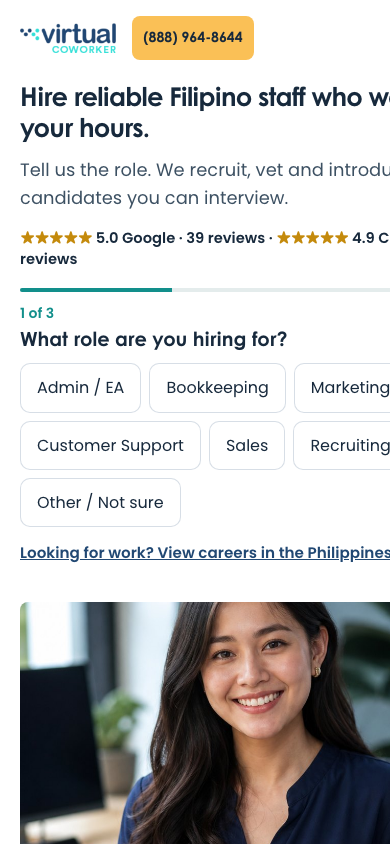
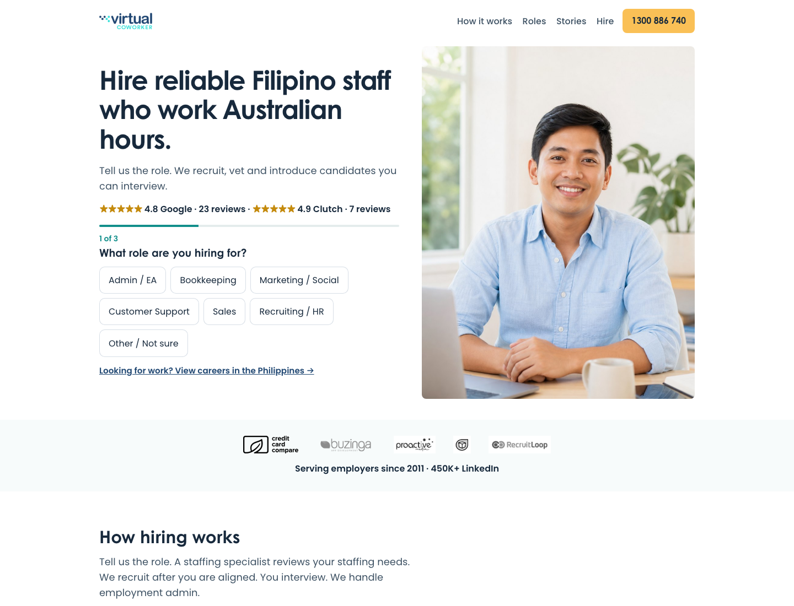
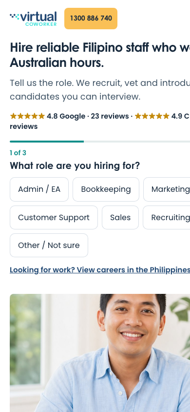
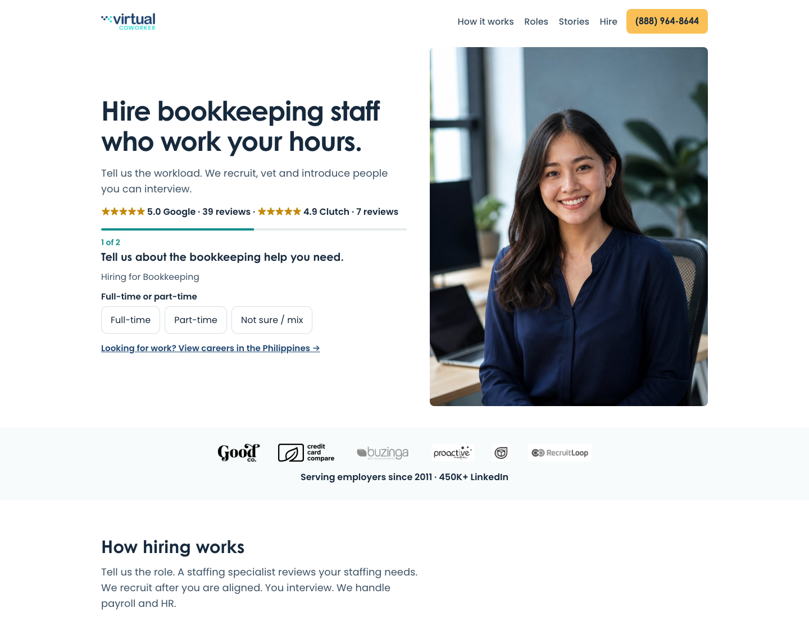
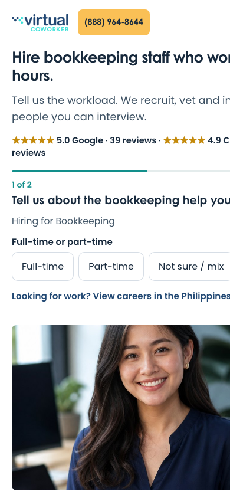

# Paid LP production rollout — 16 Aug 2026

Live host: **https://www.virtualcoworker.app**  
No Google Ads, GTM, GA4 admin, budget, keyword, or Final URL changes.

Rollback SHA was recorded **before** this commit: `7a4f8b9433a7cf429997e85835e6ffac121f8a21` (previous production `dpl_Anutdz8hCHCk624BBrou1ZnDmyj9`, 14 Aug 2026).

---

## 1. What changed

Paid employer pages on `.app` now use one shared guided-match system (Version One direction, with George’s 10 production UI corrections).

- Short hire headline + one support line + large staff photo + Google/Clutch stars
- Progressive hiring brief in the hero (role first on Core; workload first on role pages)
- Proof strip of client logos + since 2011 (ratings are not repeated there)
- Long company page: how hiring works, roles, why VC, team photo, quotes, rates explanation, FAQ, closing CTA + phone
- US vs AU phones, office, ABN, reviews, and hours language
- Job-seeker line only: “Looking for work? View careers in the Philippines →”
- No popups, chat, extra experiments, or old `/us` as a control switcher

`/api/lead`, thank-you, GTM containers, and quiz LPs (`/us/quiz`, `/au/quiz`) were left in place.

## 2. Every production route changed

**Core**

- https://www.virtualcoworker.app/us
- https://www.virtualcoworker.app/au

**US roles**

- `/us/administrative-support`
- `/us/bookkeeping`
- `/us/accounting`
- `/us/digital-marketing`
- `/us/social-media`
- `/us/customer-service`
- `/us/hr` (alias `/us/human-resources` still 308s)
- `/us/recruitment`
- `/us/sales`

**AU roles** (same slugs under `/au/`)

Query strings still work: `gclid`, `gbraid`, `wbraid`, `utm_*`, `variant`, `focus=gate`, `#gate`. Ads Final URLs were not edited.

**Not replaced:** `/us/quiz`, `/au/quiz`, `/thank-you`, `/privacy`, `/terms`, `/ph`, WordPress.

## 3. Clean US desktop and mobile screenshots

## 4. Clean AU desktop and mobile screenshots

## 5. Role-page screenshots (US Bookkeeping)

## 6. Image / testimonial source manifest

| Asset | Path | Source | What it is | Approved for paid LP | Placement |
|---|---|---|---|---|---|
| Hero US | `/brand/va-us.jpg` | Live paid LP | Existing `.app` portrait | Yes — already on live `/us` | US Core + US role heroes |
| Hero AU | `/brand/va-au.jpg` | Live paid LP | Existing `.app` portrait | Yes — already on live `/au` | AU Core + AU role heroes |
| Closer US | `/brand/hero-us-2026.jpg` | Live OG | Brand office/life still | Yes | US closing band |
| Closer AU | `/brand/hero-au-2026.jpg` | Live OG | Brand office/life still | Yes | AU closing band |
| Team floor | `/guided-match/trust-team-office.jpg` | Optimized from `vision/public/trust/choices/trust-team-office.png` | Company brand file | Yes | “Team that recruits” |
| Consult scene | `/guided-match/trust-consult.jpg` | Optimized from `vision/public/trust/choices/trust-consult.png` | Company brand file | Yes | Why-VC band |
| Logo | `/brand/logo-vc.png` | Live brand | Wordmark | Yes | Nav |
| Client marks | `/brand/trust/client-*.png` | Live TrustBand | Good Co., Credit Card Compare, Buzinga, ProActive, Learning Deli, RecruitLoop | Yes | Proof strip |
| Quotes | `PUBLIC_QUOTES` in `config/site.ts` | Published success stories | Kyrstin H. (College Hunks), Laura W. (Good Co.), David Boyd (Credit Card Compare), Logan Merrick (Buzinga) | Yes — text only, meaning not rewritten | Stories; David Boyd featured on bookkeeping/accounting |
| Ratings | `TRUST_PROOF` | GBP + Clutch | US Google 5.0/39; AU Google 4.8/23; Clutch 4.9/7 | Yes | Hero starline only |
| LinkedIn floor | 450K+ | CEO-approved display floor | Followers, not a person photo | Yes | Proof strip with 2011 |

**Not used:** `.com.ph` headshots (`talent-arvin`, `talent-john`), generated `/roles/*.png` portraits as “staff,” competitor photos, video testimonials (none approved). Role pages change headline + locked role + featured quote, not a fake candidate card.

Alt text names the company photograph, not invented employee names.

## 7. Conversion-event QA table

| Check | Result |
|---|---|
| Role / hours clicks are `quiz_started` / `guided_match_started` / `quiz_step` only, not `employer_form_started` | Code + unit tests. Live click-path not submitted. |
| Completing workload → `quiz_step_completed` (`ads_conversion: false`) | Code |
| Contact step → `quiz_completed` / `contact_step_reached` / `lead_magnet_completed` (diagnostic) | Code |
| First name/email/phone focus → `employer_form_started` + `form_start` once | Code |
| Validation fail → `employer_form_validation_error`; stay on page | Local API 400 for missing fields |
| `/api/lead` success required before `employer_inquiry_submitted` | Same `trackValidEmployerSubmit` helper as live |
| Phone → `phone_cta_clicked` + `phone_click` (`is_qualified_call: false`) | Same `trackPhoneClick` helper |
| Honeypot `website` → 403 `honeypot` | Local POST |
| Payload `lp_surface=form`, `cta_mode=form_primary`, `lp_version=stage1-v8` | Helpers + tests |
| Thank-you `?market=&sid=` | Route live 200 |
| Job-seeker fires `job_seeker_redirected` then PH careers | Code (`location.replace`) |
| `bidding_primary: false` on form success | Existing tracker |
| Guided-match events not mapped to Ads Primary | Diagnostic-only; GTM not published |
| US `(888) 964-8644` / AU `1300 886 740` | HTTP smoke on every paid route |

No production smoke lead was posted (would create a real GitHub Issue / email / CRM record). Remaining labeled-test submit is documented in §13.

## 8. Build, lint, type-check, tests

On the deploy tree (production SHA + this LP only):

- `npm run typecheck` — pass
- `npm test` — 15 files, 87 tests pass
- `npm run build` — pass (Vercel build also pass, 28s)

`/us` `/au` first-load JS ~119 kB. Tracking scripts (market GTM) unchanged.

## 9. Production deployment URL and identifier

- Public: **https://www.virtualcoworker.app**
- Deployment URL: https://vision-r5o4fhsff-shoutgeorge1s-projects.vercel.app
- Deployment ID: **`dpl_BhrTHVswjxr96bJELWu5XySVYpRd`**
- Inspector: https://vercel.com/shoutgeorge1s-projects/vision/BhrTHVswjxr96bJELWu5XySVYpRd
- Method: existing `vision/` Vercel CLI production deploy (not xray `npm run deploy`)

## 10. Git commit SHA

`c82e253bd887454463ed28338c8255fcb251a204`  
Branch: `paid-lp-guided-match-2026-08-16` (not force-pushed).

## 11. Previous production / rollback SHA

- Git: **`7a4f8b9433a7cf429997e85835e6ffac121f8a21`** (`fix: restore verified Virtual Coworker US phone number`)
- Previous Vercel production: **`dpl_Anutdz8hCHCk624BBrou1ZnDmyj9`**

Rollback: promote that deployment in Vercel, or redeploy that SHA. Do not mutate Ads to roll back.

## 12. Production smoke-test results

HTTP 200 and copy checks on:

- `/us`, `/au`
- all 9 US role slugs + remaining AU role slugs
- `/us?gclid=TESTGCLID&utm_source=google&utm_medium=cpc&utm_campaign=qa`
- `/privacy`, `/terms`, `/thank-you?market=us`

Confirmed:

- Approved US / AU headlines and phones
- Core includes Other / Not sure
- Bookkeeping (and other role LPs) skip the role chooser
- No Stage 1 / mock / review-controls chrome
- US does not force a US vs AU hours choice
- AU shows 1300 + ABN

Chrome was opened to `/us`, `/au`, `/us/bookkeeping`, and `/us` with gclid/utm.

## 13. Remaining known limitations

- No live labeled production lead was submitted. Durable delivery still goes to the existing webhook + email path. A test submit would create a real record. Do that later as a clearly named TEST lead if George wants one.
- Interactive click-through of every chip combination was not run in a headed browser (HTTP + unit tests only). Back, validation UI, and dataLayer sequence should be clicked once on live `/us`.
- Google Ads forwarding-number behavior was not re-probed (Ads UI left untouched).
- `/us/quiz` and `/au/quiz` still use the older MarketLanding form. They are not this rollout.
- GitHub remote was not pushed; live is the Vercel upload of this commit.
- Dev working tree on `vision-demo` still has unrelated dirty files; they were **not** deployed.

## 14. Exact deployment timestamp

**2026-08-16T05:40:42Z** (15 Aug 2026, 10:40 PM Pacific).  
Use this to split pre/post GA4 and Ads landing-page behavior.

## 15. Metrics to check after 24 hours and after one week

Keep Maximize Clicks. Do not change budget, CPC, keywords, or bidding.

**24 hours (directional only)**

- Paid landing sessions vs 8–14 Aug baseline (US 355 / week)
- `quiz_started` / `quiz_step` (starts, not leads)
- `employer_form_started` (contact fields)
- `employer_inquiry_submitted` and thank-you users
- `phone_cta_clicked` vs Ads website-phone clicks
- JS errors / `/api/lead` 5xx

**One week (business read)**

- Legitimate thank-you / durable submits vs form starts
- Phone clicks and duration-qualified calls
- US vs AU separately (not as an A/B)
- Core vs role pages
- Job-seeker exits vs employer completes

Do not treat role-chip clicks as a win. Hierarchy: successful employer submits and real phone outcomes → contact-step reach → guided-match progression → first role tap.

Allow ~100–200 relevant paid visits or about one week before a major creative call, unless something is technically broken.

---

## Team-update draft (do not send)

**Subject:** New employer landing pages are live on virtualcoworker.app

The US and Australian paid landing pages on virtualcoworker.app now use the guided hiring brief we approved. Ads themselves were not changed — existing links already point here.

What visitors see: a short hire headline, a real photo, Google and Clutch ratings, and a first question about the role (or the workload on a role-specific page). Contact details come after that. Phone numbers are unchanged: (888) 964-8644 in the US, 1300 886 740 in Australia.

We did not send a test enquiry through the live form, so sales inboxes should not get a junk TEST record from this launch. If a clearly labeled test lead is needed, we can do one later.

Please look at https://www.virtualcoworker.app/us and https://www.virtualcoworker.app/au. If anything looks wrong, we can revert to the previous site build without touching ads.
